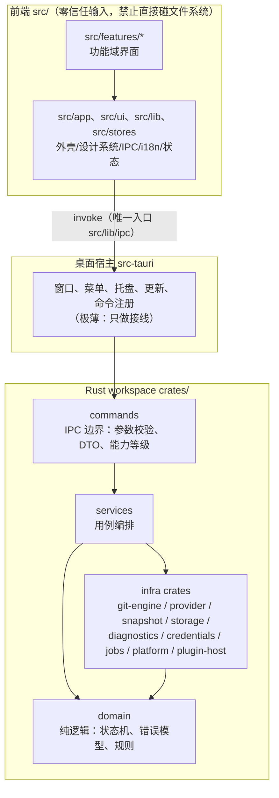

# ForgeDesk 架构

> 本文件说明**代码实际如何分层、数据如何流动、在哪里扩展**。
>
> 优先级：`AGENTS.md`（最高） > 本文件 > `docs/PLAN.md`（计划与理由）。
> 若本文件与 `AGENTS.md` 冲突，以 `AGENTS.md` 为准并修正本文件。
>
> 逐任务提示词见 `AGENT-PROMPTS.md`，本地开发环境见 `DEV-ENV.md`。

---

## 1. 分层总览



**一句话**：前端只认 IPC 契约；`commands` 只做边界工作；`services` 编排用例；
`domain` 是纯逻辑且不碰 IO；所有与外界打交道的事（进程、数据库、网络、文件、钥匙串、时钟）
都落在 `crates/` 下的 infra crate。

---

## 2. crate 职责与状态

`谁能依赖它`一列是**硬约束**：违反会在评审与 `cargo` 依赖图里暴露，不在运行时才炸。

| crate | 职责（一句话） | 谁能依赖它 | 状态（M0 末） |
| --- | --- | --- | --- |
| `crates/domain` | 纯逻辑：领域模型、状态机、错误类型与错误码分类 | 所有 Rust crate | ✅ 错误模型与 `ErrorCode::classify` + 补丁裁剪（T1.6）+ 提交计划模型（T1.7） |
| `crates/commands` | Tauri 命令定义、DTO 转换、能力等级校验、写操作审计拦截 | `src-tauri` | ✅ 35 个命令（含 2 个仅开发构建）：仓库 / 工作区 / diff / 暂存 / 提交 / 快照 / 审计；另有监听注册表（T1.10，无命令） |
| `crates/services` | 用例编排（打开仓库、工作区状态、部分暂存、提交、审计…） | `commands`、`plugin-host` | ✅ `RepositoryService`（T1.3）+ `WorkspaceService`（T1.4）+ `StagingService`（T1.6，含 400 组对拍测试）+ `CommitService`（T1.7/T1.8）+ `AuditLog`（T1.11：脱敏/2KB 摘要/保留策略/导出） |
| `crates/git-engine` | `GitEngine` trait + CLI 实现 + libgit2 实现 | `services`、`snapshot`、`commands` | ✅ `GitProcess` 执行器 + 4 个解析器（T1.1）+ `GitEngine` 双实现与差分测试（T1.2）+ 统一补丁解析（T1.5）+ 补丁应用通道（T1.6） |
| `crates/provider` | `HostProvider` trait + GitHub/GitLab/Gitea 实现 | `services`、`commands` | ⬜ 骨架（M4） |
| `crates/snapshot` | 快照创建/列表/回滚/校验 | `services`、`commands` | ✅ ref 锚点快照（T1.9：`refs/forgedesk/snapshots/<id>` 防 gc、回滚前自动打保护点、双引擎校验、保留策略） |
| `crates/diagnostics` | 日志脱敏、stderr 解析、错误码映射、修复建议 | `commands`、`platform`、`git-engine`、`src-tauri` | ✅ 脱敏写入层（592 行）；规则引擎 M5 |
| `crates/storage` | SQLite 仓储、版本化迁移、设置读写、操作审计 | `commands`、`services`、`src-tauri` | ✅ 7 张表 + 迁移 + `OperationStore`（T1.7：`operation_records` 审计） |
| `crates/credentials` | keyring 封装、账号模型 | `services`、`commands` | ⬜ 骨架（M4） |
| `crates/jobs` | 任务注册、进度广播、取消令牌 | `services`、`commands` | ✅ 注册表 + 进度广播 + 取消（T1.3 起用于克隆） |
| `crates/platform` | 平台适配：日志文件、会话标记、shell 解析、路径规范化、系统集成、文件监听 | `commands`、`src-tauri` | ✅ 日志/panic/会话/打开目录（T0.8）+ 文件监听（T1.10：噪声过滤 / 去抖动 / 溢出保护，**不依赖 Tauri**） |
| `crates/plugin-host` | 插件加载、权限、WASI 沙箱、插件 API | `commands` | ⬜ 骨架（M6） |
| `src-tauri` | 窗口与命令注册；**极薄**，不含业务逻辑 | 无（顶层） | ✅ 日志初始化、迁移、命令注册 |
| `src/` | 前端：路由、外壳、设计系统、状态、IPC 封装 | 无（顶层） | ✅ 外壳 + 20 条路由 + 组件库 |

**与 `PLAN.md` §5.2 的差异（有意为之）**：PLAN 的模块表未列 `crates/platform`，
而 §5.9 又要求存在一个统一的平台适配层（凭据库、shell 解析、路径规范化、监听器、通知）。
本项目按 §5.9 落地，并以 `crates/platform` 承载：**PLAN 的模块表是早期草表，本文件是实际结构**。
新增 crate 必须同时更新本表与根 `Cargo.toml` 的 `members`。

---

## 3. 依赖方向规则

| 规则 | 说明 | 由什么保证 |
| --- | --- | --- |
| 前端不得直接访问文件系统或执行命令 | 一律经 `src/lib/ipc/index.ts` | ESLint 架构护栏（禁止 `@tauri-apps/api/*` 出现在该文件之外） |
| `domain` 不依赖任何 IO crate | 不许出现 `git2`/`rusqlite`/`reqwest`/`std::process` 等 | `crates/domain/tests/` 的依赖断言 + 根 `Cargo.toml` 的 crate 依赖清单 |
| 依赖只能"由外向内" | `commands → services → domain`，infra 只依赖 `domain` | 代码评审 + `Cargo.toml` 显式依赖（无 `*` 通配） |
| 唯一的 infra → infra 例外 | `git-engine → diagnostics`：git 的参数与输出都可能带凭据，写日志前必须过 `sanitize_log`（红线 R8）。若各自实现一套脱敏规则，迟早出现"一处漏了"的情况 | 评审；新增同类例外必须在此登记理由 |
| workspace 成员必须真实存在于仓库 | 防止"本地有、仓库没有"导致的 CI 失败 | `pnpm check:repo` |
| 能力等级必须声明 | 每个命令标注 `ReadOnly`/`Mutating`/`Network`/`Dangerous` | `docs/API.md` 登记表 + 评审 |
| 只有一条写入口 | 改仓库状态必须经 `SnapshotManager` + `AuditLog`（红线 R7） | 评审 + 破坏性操作测试矩阵（M3） |

---

## 4. 数据流示例

以下三条覆盖了本项目的主要形态：**写操作（有安全网）**、**长任务（有进度与取消）**、
**网络读取（有缓存与限流）**。实现进度：三条均在 M1–M4 落地，当前只有"读取设置"这条短链路可用。

### 4.1 提交（写操作：预览 → 快照 → 执行 → 可回滚）

```text
UI 填写提交信息
  → commit_prepare(plan)            生成 CommitPlan（含将要执行的等价 git 命令）
  → 预览对话框（用户确认）           SafeOperation：明确列出影响与回滚方式
  → commit_execute(planId)          计划可能已过期 → 重新校验 → PLAN_STALE
  → SnapshotManager.create("pre-commit")     （红线 R7 的安全网）
  → AuditLog.record(操作、参数摘要已脱敏、结果)
  → GitEngine.commit(...)            写操作走系统 git CLI（正确性优先）
  → 成功：事件通知 + 前端 Query 失效重取；失败：Diagnostics.parse(stderr) → AppError
```

**要点**：计划与执行分离（`prepare`/`execute`）让"用户看到的"和"实际执行的"是同一份数据；
快照在**执行之前**创建，因此任何失败都能回滚。

### 4.2 Pull 与冲突（长任务：进度事件 + 可取消 + 可中止）

```text
pull_execute(remote, branch, strategy)
  → 超过 500ms：注册为 Job（返回 jobId），进度经 job:progress 事件推送
  → SnapshotManager.create("pre-pull")
  → GitEngine.fetch()（网络，支持取消令牌）
  → 策略判定：ff-only / merge / rebase
  → 冲突：进入 ConflictWizard（三栏），逐文件 mark_resolved(path)
  → continue_operation()  或  abort_operation()  →  可选 rollback_to_snapshot()
```

**要点**：`git:state-changed` 事件让界面知道"仓库正处于 rebase 中途"——
这是刷新页面后仍要能恢复的**持久状态**，不能只存在前端内存里。

### 4.3 GitHub 拉取请求（网络读取：缓存 + 限流降级）

```text
pr_detail(owner, repo, number)
  → Provider.get_pull_request()
  → CacheStore：带 ETag，命中 304 → 直接用缓存（不消耗配额）
  → 未命中 → 请求 API → 写缓存
  → 403/429 → RateLimitError（含 reset 时间）→ UI 显示缓存 + 明确提示
```

**要点**：网络失败不能让用户看到空白页。缓存是**降级路径**的一部分，
因此"缓存中的数据 + 明确的过期提示"优于"什么都没有"。

---

## 5. 扩展点

| 扩展点 | 位置 | 新增一类实现时要做什么 |
| --- | --- | --- |
| Git 引擎 | `crates/git-engine` | 实现 `GitEngine` trait；跑**双实现差分一致性测试**（含 merge/分叉/重命名/二进制/大文件/子模块的临时仓库）；新增公开 API 必须有 rustdoc |
| 托管平台 | `crates/provider` | 实现 `HostProvider`；UI **必须依据 capabilities 隐藏/禁用**，禁止按 provider 名字写 if；`ProviderRegistry` 需覆盖 ≥15 种 URL 变体的表驱动单测 |
| 诊断规则 | `crates/diagnostics/rules/*.yaml`（M5） | 规则只写 i18n key、不写文案；`kind=dangerous` 的动作必须走危险确认对话框，不允许一键执行 |
| 插件 | `crates/plugin-host`（M6） | 目录 + `plugin.json` + WASM/JS 入口；权限逐项授权；**插件 API 不提供 AI 推理能力，也不得访问系统 keyring**（红线 R1） |
| 前端页面 | `src/features/<域>/` | 新页面 = 路由条目（`src/app/routes.tsx`）+ 导航项（`src/app/shell/navItems.ts`）+ 只走 i18n 的文案；空页面用 `PlaceholderPage` 并标注归属任务号 |
| UI 组件 | `src/ui/components/` | 通用能力放这里（Radix 原语 + 语义 token），**不要**在功能目录里复制一份 |

---

## 6. 边界与"不在这里做"的事

- **不做 AI 推理**（红线 R1）：仓库里没有模型、没有推理服务；AI 只用于开发阶段写代码。
- **前端不做 Git**：任何 Git 语义（分支、状态判定、rebase 计划）都在 Rust 侧，前端只呈现。
- **不在 `commands` 里写业务**：命令层只做参数校验、DTO 与错误转换（见 `crates/commands/src/lib.rs` 的职责说明）。
- **不把 Git 状态放进 Zustand**：Git 状态是"服务端状态"，走 TanStack Query；
  Zustand 只放 UI 状态（侧栏、主题、面板位置、当前仓库 id）。
- **不引入遥测**（M7 前不做，且必须自建、默认关闭、可预览发送内容）。

---

## 7. 相关文档

- 任务顺序与验收标准：[`PLAN.md`](./PLAN.md)
- 逐任务提示词：[`AGENT-PROMPTS.md`](./AGENT-PROMPTS.md)
- IPC 契约（命令与事件登记表）：[`API.md`](./API.md)
- 编码风格：[`CODING_STYLE.md`](./CODING_STYLE.md)
- 本地环境与陷阱：[`DEV-ENV.md`](./DEV-ENV.md)
- 参与方式：[`../CONTRIBUTING.md`](../CONTRIBUTING.md)
- 最高优先级公约：[`../AGENTS.md`](../AGENTS.md)
