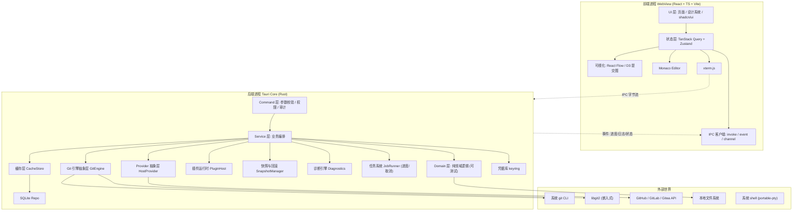

# ForgeDesk 项目计划书

> 版本：v1.0（规划稿）
> 日期：2026-09-22
> 状态：待评审
> 文档性质：面向人类维护者 + AI 编码代理的可执行工程计划
> 适用对象：项目负责人、架构师、前端/后端/Rust 工程师、AI 编码代理（Coding Agent）

---

## 目录

- [0. 如何使用本计划书](#0-如何使用本计划书)
- [1. 项目概述](#1-项目概述)
  - [1.1 一句话定位](#11-一句话定位)
  - [1.2 要解决的痛点](#12-要解决的痛点)
  - [1.3 核心价值](#13-核心价值)
  - [1.4 项目边界（不包含 AI 功能）](#14-项目边界不包含-ai-功能)
  - [1.5 命名、标语与品牌资产](#15-命名标语与品牌资产)
  - [1.6 成功指标](#16-成功指标)
- [2. 目标用户与使用场景](#2-目标用户与使用场景)
  - [2.1 用户画像](#21-用户画像)
  - [2.2 典型使用场景](#22-典型使用场景)
  - [2.3 用户故事](#23-用户故事)
  - [2.4 痛点—功能映射矩阵](#24-痛点功能映射矩阵)
- [3. 竞品与差异化](#3-竞品与差异化)
  - [3.1 竞品分析表](#31-竞品分析表)
  - [3.2 差异化定位](#32-差异化定位)
  - [3.3 合规红线：不可复制竞品 UI](#33-合规红线不可复制竞品-ui)
- [4. 功能范围](#4-功能范围)
  - [4.1 分层策略](#41-分层策略)
  - [4.2 功能总表](#42-功能总表)
  - [4.3 明确"不做"清单](#43-明确不做清单)
  - [4.4 范围控制流程](#44-范围控制流程)
- [5. 技术架构](#5-技术架构)
- [6. 技术栈与选型理由](#6-技术栈与选型理由)
- [7. 里程碑计划（M0–M8）](#7-里程碑计划m0m8)
- [8. 产品化与分发](#8-产品化与分发)
- [9. 合规与知识产权](#9-合规与知识产权)
- [10. 测试与质量](#10-测试与质量)
- [11. CI/CD 与发布](#11-cicd-与发布)
- [12. 成本与资源](#12-成本与资源)
- [13. 风险与缓解](#13-风险与缓解)
- [14. 推广与社区](#14-推广与社区)
- [15. 附录](#15-附录)

---

## 0. 如何使用本计划书

本文件**同时**服务三类读者，阅读方式不同：

| 读者 | 关注章节 | 使用方式 |
| --- | --- | --- |
| 项目负责人 / PM | 1、2、3、4、7、12、13、14 | 用于决策范围、排期、成本与风险 |
| 架构师 / 工程师 | 5、6、9、10、11 | 用于落地技术方案与质量门禁 |
| AI 编码代理 | 7（每节末尾"给编码 Agent 的提示词"） | 直接复制提示词执行；执行前必须先读取对应章节与 `docs/` 下的规范文件 |

### 0.1 约定与假设

- 本计划书中标注 **「假设」** 的内容为信息不足时的合理推定，需在 M0 评审会上确认或修正。
- 标注 **「待定」** 的内容表示需要在特定里程碑前完成决策（有 Decision 记录）。
- 所有工时以"人日"（1 人日 = 6 小时有效编码时间）估算，面向 1 名熟悉技术栈的全职工程师 + AI 代理辅助。
- 所有"验收标准"必须可在 CI 或人工清单中**客观判定**（可通过 / 不可通过），禁止使用"体验良好"这类主观表述。
- **本计划书不包含任何代码实现**，只做规划；实现由后续按里程碑拆解执行。

### 0.2 AI 编码代理执行公约（所有里程碑通用）

```text
【ForgeDesk 编码代理公约】
1. 每次任务开始前，必须先阅读：docs/PLAN.md 对应章节 + docs/ARCHITECTURE.md + docs/CODING_STYLE.md（若存在）。
2. 必须遵守"能运行、能打包"原则：每个里程碑结束代码仓库必须处于可编译、可启动状态。
3. 禁止引入任何 AI/LLM 推理依赖到产品运行时（详见 1.4 项目边界）。
4. 禁止复制任何竞品（GitHub Desktop / GitKraken / Sourcetree / Fork / Git-cola）的 UI 布局、图标、配色与文案；所有界面必须原创设计。
5. 禁止使用 Git / GitHub / Tauri 官方 Logo 或 Octocat 等商标素材；图标必须原创（详见第 9 章）。
6. 所有破坏性 Git 操作（reset --hard / clean -fdx / push --force / branch -D 等）必须先经"操作计划预览"层，禁止直接执行。
7. 每个新增的 Rust 命令（Tauri command）必须有对应单元测试；每个新增的核心组件必须有 Vitest 测试。
8. 每完成一个任务，必须运行：`pnpm lint && pnpm typecheck && pnpm test` 与 `cargo test`，全绿才可提交。
9. 提交信息遵循 Conventional Commits（feat/fix/chore/docs/test/refactor）。
10. 若需求含糊，做出最小合理假设并在 PR 描述中显式标注「假设：…」，不要停下来等待。
```

---

## 1. 项目概述

### 1.1 一句话定位

> **ForgeDesk 是一个开源、跨平台、可自由分发的 Git/GitHub 图形化桌面工作台，把复杂的 Git 与 GitHub 终端操作转化为可视化界面、向导和可交互图表。**

- 产品名：**ForgeDesk**（不含 "Git"/"GitHub" 字样，规避商标风险）
- 描述语（对外统一）：
  - 完整版：**"ForgeDesk — A Git client for everyone"**
  - 中文版：**"ForgeDesk —— 一款面向所有人的 Git 桌面客户端"**
  - 兼容表述：**"ForgeDesk for Git"**
- 一句话卖点（营销）：**"看得见的 Git，不只是命令行。"**
- 许可：**Apache-2.0**（详见第 8 章选型论证）

### 1.2 要解决的痛点

| # | 痛点 | 现状 | ForgeDesk 解法 |
| --- | --- | --- | --- |
| P1 | 命令行门槛高，记不住命令与参数 | `git rebase -i HEAD~3`、`git reset --soft/mixed/hard` 语义混乱 | 图形化向导 + 命令解释器（每步展示等价 git 命令） |
| P2 | 破坏性操作不可逆、心理负担重 | `reset --hard` 后代码丢失 | **操作快照 + 一键回滚**（执行前自动打 reflog 快照点） |
| P3 | 冲突解决恐怖 | 手工编辑 `<<<<<<<` 标记易错 | **三栏合并编辑器** + 逐块接受/拒绝 + AI-free 结构化向导 |
| P4 | 分支/历史看不懂 | `git log --graph` 在终端里挤成一团 | **交互式 DAG 提交图**，可拖拽、可筛选、可点选查看 diff |
| P5 | 怕 rebase / squash | 交互式 rebase 易把历史搞乱 | 拖拽 + squash/drop/fixup 的**可视化 rebase**，实时预览结果 |
| P6 | GitHub 操作要在浏览器与终端间来回切 | clone/fork/PR/issue 分散在网页 | 内建 GitHub 工作区：仓库、PR、Issue、Actions、Release、Gist、通知 |
| P7 | 出错后不知道怎么救 | `git` 报错信息晦涩 | **错误诊断引擎**：解析 stderr → 定位原因 → 给出可点击修复动作 |
| P8 | 多平台工具体验不一致 | 各客户端平台支持参差 | Tauri 多平台统一打包（Windows/macOS/Linux） |
| P9 | 团队可视化审查成本高 | 需要第三方平台 | 本地历史审查 + PR 内联 diff 审查 |
| P10 | 现有工具或闭源或收费或臃肿 | GitKraken/Fork 收费，Sourcetree 停更倾向 | **完全开源、可自行分发、无强制账号** |

### 1.3 核心价值

1. **降低门槛**：把"要知道命令"变成"看得见的选择"。每一步操作都显示等价 git 命令，反向学习。
2. **安全第一**：任何破坏性操作都有"计划预览 → 快照 → 执行 → 可回滚"四道防线。
3. **可视化深度**：DAG 图、rebase 拖拽、三栏合并，是产品的"记忆点"能力（差异化核心）。
4. **一体化**：本地 Git + 远端 GitHub + 终端 + 编辑器，同一窗口内完成 90% 日常工作流。
5. **可扩展可分发**：插件系统 + 主题 + 语言包，任何人都能打包和再分发。
6. **免费开源**：无账号强制、无遥测默认、无功能墙。

### 1.4 项目边界（不包含 AI 功能）

> **这是硬边界，必须在所有 PR 评审中作为红线检查项。**

| 类别 | 包含（In Scope） | 不包含（Out of Scope） |
| --- | --- | --- |
| 产品能力 | Git/GitHub 图形化操作、可视化、向导、终端、编辑器 | ❌ 任何 LLM/机器学习推理、AI 代码生成、AI 提交信息生成、AI 冲突自动解决、AI 代码审查 |
| 运行时依赖 | 本地 Git、GitHub API、SQLite、系统 Keychain | ❌ OpenAI/Anthropic/本地模型等任何推理服务或模型权重 |
| AI 的角色 | **仅用于本项目开发阶段**：由 AI 编码代理编写代码、写测试、写文档 | ❌ AI 不作为产品功能交付给最终用户 |
| 网络调用 | 仅 GitHub/GitLab/Gitea 官方 API + 用户显式配置的代理 | ❌ 任何第三方分析/埋点服务（默认关闭且仅本地统计） |

**边界说明（对用户可见的措辞）**：ForgeDesk 不提供任何人工智能功能，它是一个纯粹的 Git/GitHub 效率工具。项目开发过程中使用 AI 辅助编码，但这不影响产品本身零 AI、可完全离线工作的特性。

### 1.5 命名、标语与品牌资产

| 项目 | 内容 | 备注 |
| --- | --- | --- |
| 产品名 | ForgeDesk | 不含 Git/GitHub/Tauri 字样，符合商标白名单 |
| 中文名 | 铸台 / ForgeDesk（音译统一用英文名） | 「假设」中文名仅为内部讨论用，对外统一英文名 |
| 简称 | FD | 用于包名、环境变量前缀 |
| 包名 | `forgedesk`（npm/Rust crate：`forgedesk`、`forgedesk-core`） | 需在 crates.io / npm 抢注 |
| 标语 | "看得见的 Git，不只是命令行。" | |
| 图标 | **完全原创**：几何"锻炉/砧台"抽象图形，蓝紫渐变 + 折迭线条 | 禁止任何 Git 分支符号直译、禁止 Octocat 变体 |
| 主色 | 深空蓝 `#1E293B` / 主强调 `#6366F1`（靛蓝） | 与竞品配色差异化，需做视觉区分度评审 |

### 1.6 成功指标

| 层级 | 指标 | M4 目标 | M8 目标（发布后 12 个月） |
| --- | --- | --- | --- |
| 产品 | 首个稳定版可下载可安装 | ✅ | — |
| 用户 | GitHub Star | 200 | 5,000 |
| 用户 | Release 下载量（全平台累计） | 500 | 50,000 |
| 质量 | 崩溃率（Crash-free session） | ≥ 98% | ≥ 99.5% |
| 质量 | 破坏性操作导致用户数据丢失的 Issue | 0 | 0 |
| 工程 | CI 主分支通过率 | ≥ 95% | ≥ 99% |
| 社区 | 外部贡献者 PR | 3 | 50 |
| 性能 | 冷启动到可交互（10 万提交仓库） | < 4s | < 2s |
| 性能 | 提交图渲染 10 万节点 | 可用（< 3s 首屏） | 流畅（虚拟化） |

---

## 2. 目标用户与使用场景

### 2.1 用户画像

| 画像 | 角色 | 技术水平 | 核心诉求 | 典型痛点 | 使用频率 |
| --- | --- | --- | --- | --- | --- |
| U1 新手开发者 | 学生 / 转行新人 | Git 只会 add/commit/push | 不要让我把仓库搞坏 | 冲突、误删、force push | 每周数次 |
| U2 GitHub 新用户 | 首次参与开源 | 会用网页，不会命令行 | 完成 fork → PR 全流程 | 分支、上游、PR 流程 | 每月数次 |
| U3 效率型中级开发者 | 3–5 年经验 | 熟悉命令行 | 更快地看 diff/改历史 | 频繁切上下文 | 每天 |
| U4 团队审查者 | Tech Lead / Reviewer | 高级 | 可视化审查提交与冲突 | 长 PR 阅读成本 | 每天 |
| U5 开源贡献者/独立开发者 | Indie / Maintainer | 高级 | 管理多仓库、多账号、发 Release | 多账号、多平台切换 | 每天 |

### 2.2 典型使用场景

**场景 A：新手首次贡献开源（对应 U1/U2）**

1. 打开 ForgeDesk → 在 GitHub 面板搜索目标仓库 → Fork & Clone（一键完成，自动配置 upstream remote）。
2. 创建特性分支（向导提示命名规范）。
3. 修改文件 → 内置 Monaco 编辑器 + 暂存区逐块暂存。
4. 提交（表单校验：提交信息非空 / 空提交拦截）→ Push（自动设置 upstream）。
5. 一键创建 PR（自动填标题、正文模板、目标分支、关联 issue）。
6. PR 被要求改 → 在 PR 页看到 Review 评论 → 本地修改 → push 自动更新 PR。

**场景 B：日常开发节奏（对应 U3）**

1. 早上打开 → 仪表盘显示所有已打开仓库的分支状态、behind/ahead、CI 状态。
2. 切换分支 → 自动 fetch（可配置）→ Pull（rebase 或 merge 由配置决定）。
3. 使用"操作快照"随时回滚。

**场景 C：历史整理与冲突（对应 U3/U4）**

1. 打开 DAG 图 → 拖拽 rebase → squash 三个提交 → 预览新历史 → 应用。
2. 出现冲突 → 进入三栏合并向导 → 逐块接受 → 标记已解决 → 继续 rebase。
3. 出错 → 操作历史面板 → 一键回滚到快照点。

**场景 D：团队审查（对应 U4）**

1. PR 列表（筛选：待我审查 / 我创建的 / 涉及我）。
2. 打开 PR → 文件树 + 内联 diff → 逐行评论 → 提交 Review（Approve/Request changes/Comment）。
3. 查看 Actions 日志判断可否合并。

**场景 E：发布与维护（对应 U5）**

1. Release 面板创建 Tag → 写 Release Notes → 上传产物 → 发布。
2. Gist 管理、通知中心处理 mention 与 CI 失败。

### 2.3 用户故事

| ID | 作为 | 我希望 | 以便 | 验收要点 | 里程碑 |
| --- | --- | --- | --- | --- | --- |
| US-001 | 新手 | 打开本地已有仓库并看到文件变化 | 知道改了什么 | 打开目录后 2s 内显示变更列表 | M1 |
| US-002 | 新手 | 逐块暂存文件的部分修改 | 避免一次提交混杂内容 | 行级/块级 hunk 暂存正确生效 | M1 |
| US-003 | 开发者 | 提交前看到将要执行的 git 命令 | 学习并信任工具 | 提交预览面板显示等价命令 | M1 |
| US-004 | 开发者 | 看到分支与提交的图形化历史 | 理解项目结构 | DAG 正确渲染 merge/分叉 | M2 |
| US-005 | 开发者 | 一键 fetch/pull/push 且看到进度 | 不用记命令 | 进度条 + 冲突时进入向导 | M2 |
| US-006 | 开发者 | 可视化拖拽整理提交 | 不懂 rebase -i 也能整理 | 拖拽后生成正确 rebase 计划 | M3 |
| US-007 | 开发者 | 在图形界面解决合并冲突 | 不再手改标记符 | 三栏编辑器 + 逐块操作 | M3 |
| US-008 | 谨慎的开发者 | 误操作后一键回滚 | 不怕搞坏仓库 | 快照列表 + 回滚成功验证 | M3 |
| US-009 | GitHub 用户 | 登录并管理多个 GitHub 账号 | 区分工作与个人 | OAuth + keyring 存储 | M4 |
| US-010 | 贡献者 | 在应用内创建并管理 PR | 不用切浏览器 | 创建/评论/合并全流程可用 | M4 |
| US-011 | 维护者 | 查看 Actions 状态与日志 | 快速定位 CI 失败 | 状态徽章 + 日志流式加载 | M4 |
| US-012 | 学习者 | 内嵌终端里执行 git 并理解报错 | 边用边学 | 终端可用 + 错误诊断建议 | M5 |
| US-013 | 高级用户 | 用插件扩展功能 | 满足个性化需求 | 插件 API + 示例插件 | M6 |
| US-014 | 用户 | 应用自动更新 | 保持最新 | 检查更新 + 增量下载 + 重启生效 | M7 |
| US-015 | 隐私敏感用户 | 关闭全部遥测且离线可用 | 放心使用 | 默认关闭 + 无网络仍可用核心功能 | M7 |

### 2.4 痛点—功能映射矩阵

| 痛点 | 对应功能模块 | 里程碑 | 差异化权重 |
| --- | --- | --- | --- |
| P1 门槛高 | 命令解释器、内置向导 | M1/M5 | ★★★ |
| P2 破坏性操作 | 快照与回滚、计划预览 | M3 | ★★★★★ |
| P3 冲突 | 三栏合并向导 | M3 | ★★★★★ |
| P4 历史难懂 | DAG 提交图 | M2 | ★★★★ |
| P5 rebase 恐惧 | 可视化交互式 rebase | M3 | ★★★★★ |
| P6 GitHub 割裂 | GitHub 工作区 | M4 | ★★★★ |
| P7 报错难懂 | 错误诊断引擎 | M5 | ★★★★ |
| P8 平台不一致 | Tauri 多平台 | M7 | ★★★ |
| P9 审查成本 | 内联 diff 审查 | M4 | ★★★ |
| P10 工具闭源收费 | 开源 + 多分发渠道 | M7/M8 | ★★★★ |

---

## 3. 竞品与差异化

### 3.1 竞品分析表

> 说明：下表为**能力/定位层面**的对比，仅用于确定差异化方向。**严禁**据此复刻任何竞品的界面布局、配色、图标与交互细节。

| 维度 | GitHub Desktop | GitKraken | Sourcetree | Fork | Git-cola | ForgeDesk（目标） |
| --- | --- | --- | --- | --- | --- | --- |
| 开源 | ✅ MIT | ❌ 商业 | ❌ 免费闭源 | ❌ 商业 | ✅ GPL-2.0 | ✅ Apache-2.0 |
| 平台 | Win/mac | Win/mac/Linux | Win/mac | Win/mac | Win/mac/Linux | Win/mac/Linux |
| 价格 | 免费 | 订阅（免费档受限） | 免费 | 一次性付费 | 免费 | 免费 |
| 冲突解决 | 基础 | 有合并工具 | 有 | 优秀 | 基础 | **三栏向导（重点）** |
| 交互式 rebase 可视化 | ❌ | ✅（强） | 有限 | ✅ | ❌ | ✅（拖拽 + 预览） |
| DAG 历史图 | 简化 | ✅（强） | ✅ | ✅ | 基础 | ✅（可交互 + 筛选） |
| 多托管平台 | 仅 GitHub | 多平台 | 多平台 | 多平台 | 多平台 | GitHub 优先 → GitLab/Gitea |
| 内嵌终端 | ❌ | 部分 | ✅ | ✅ | ✅ | ✅ + 命令解释/诊断 |
| 插件系统 | ❌ | 有限 | ❌ | ❌ | ✅（脚本） | ✅（WASM/JS 插件） |
| 快照回滚 | ❌ | 有限 | ❌ | 有限 | ❌ | **✅ 核心能力** |
| 遥测 | 有 | 有 | 有 | 有 | 无 | **默认关闭** |
| 体积/启动 | 中（Electron） | 大（Electron） | 中 | 中 | 小 | **小（Tauri/Rust）** |
| 可自行分发 | 受限 | ❌ | 受限 | ❌ | ✅ | ✅ |

### 3.2 差异化定位

**一句话：ForgeDesk = "安全 + 可视化 + 可扩展"的开源 Git 工作台。**

三条护城河（按优先级）：

1. **安全网（Safety Net）**：业界首个把"操作快照 + 计划预览 + 一键回滚"做成默认流程的 Git 客户端。用户再做破坏性操作时不恐慌。这是**情感价值 + 硬功能**的组合，最难被免费竞品快速复制。
2. **可视化深度**：DAG 图 + 拖拽 rebase + 三栏合并三者打通为**一条可视化流水线**（图 → 选择 → 操作 → 预览 → 应用 → 回滚），而非三个孤立功能。
3. **可扩展的开源生态**：插件系统 + 主题 + 语言包 + 多托管适配层（Provider Adapter），让社区能自行扩展，形成网络效应。

**不做的事**：不与 GitKraken 竞争"团队协作看板/Insights 报表"，不与 GitHub 官网竞争"代码托管与 CI 运行"。

### 3.3 合规红线：不可复制竞品 UI

| 红线 | 具体要求 |
| --- | --- |
| 布局 | 不得逐像素复刻任何竞品的主界面布局（侧栏宽度、面板排列、按钮位置组合需独立设计） |
| 图标 | 图标必须使用**自绘 SVG 图标集**，不得使用竞品图标或 Feather/Heroicons 之外未授权素材（推荐自绘 + 开源图标库组合并标注许可） |
| 配色 | 使用 1.5 节定义的自有配色体系，不得使用 GitKraken 紫/橙、GitHub Desktop 蓝灰等竞品品牌色组合 |
| 文案 | 不得复制竞品文案；错误提示、向导说明需原创 |
| 截图 | README/官网中不得放置竞品截图作为"对比图"，仅可用文字表格对比 |
| 代码 | 不得反编译、复制竞品代码；不得引入许可不兼容的代码 |

**设计流程要求**：M0 阶段必须先产出 Figma/自绘线框（原创），并通过"视觉区分度评审"（3 人盲测能区分 ForgeDesk 与竞品截图）后才进入实现。

---

## 4. 功能范围

### 4.1 分层策略

| 层级 | 定义 | 时间窗 | 质量要求 |
| --- | --- | --- | --- |
| **MVP**（M1–M4） | 没有它产品不成立 | 0–6 个月 | 稳定可用、测试覆盖 ≥ 60% |
| **进阶**（M5–M6） | 构成竞争力 | 6–10 个月 | 可用、测试覆盖 ≥ 70% |
| **长期**（M7–M8+） | 生态与分发 | 10–18 个月 | 可持续维护 |
| **不做** | 明确排除 | — | 见 4.3 |

### 4.2 功能总表

> 优先级：P0 = MVP 必须，P1 = MVP 后紧接，P2 = 长期。
> 阶段列：MVP / V1.1 / V2。

#### 4.2.1 本地 Git 核心（模块：`git-core`）

| ID | 功能 | 说明 | 阶段 | 优先级 |
| --- | --- | --- | --- | --- |
| GIT-01 | 打开仓库 | 目录选择 / 拖拽 / 最近列表 / 自动识别子目录中的仓库 | MVP | P0 |
| GIT-02 | 克隆仓库 | URL/账号克隆，选择目录、深度克隆、子模块选项、SSH/HTTPS | MVP | P0 |
| GIT-03 | 初始化仓库 | `git init`，选择默认分支名、是否生成 .gitignore/LICENSE | MVP | P0 |
| GIT-04 | 工作区状态 | 已暂存/未暂存/未跟踪/冲突/忽略文件分组展示 | MVP | P0 |
| GIT-05 | 暂存/取消暂存 | 文件级、块级(hunk)、行级(line) | MVP | P0 |
| GIT-06 | Diff 查看 | 并排/内联、语法高亮、空白忽略、大文件截断 | MVP | P0 |
| GIT-07 | 提交 | 提交信息、描述、署名、签名（GPG/SSH）、提交钩子状态提示 | MVP | P0 |
| GIT-08 | 修改最后一次提交 | amend（含仅改信息 / 含内容） | MVP | P0 |
| GIT-09 | 撤销工作区修改 | discard（单文件/块级，带预览与二次确认） | MVP | P0 |
| GIT-10 | 提交前/后钩子展示 | 展示 `.git/hooks` 与 husky 结果 | V1.1 | P1 |
| GIT-11 | 分支管理 | 创建/切换/重命名/删除/跟踪设置/分支比较 | MVP | P0 |
| GIT-12 | 标签管理 | 轻量/附注标签、推送标签、删除 | MVP | P0 |
| GIT-13 | Stash | 保存/应用/弹出/删除/查看 diff/命名 stash | MVP | P0 |
| GIT-14 | Cherry-pick | 单/多提交挑选，冲突进入向导 | MVP | P0 |
| GIT-15 | Revert | 单/多提交撤销，冲突进入向导 | MVP | P0 |
| GIT-16 | Reset | soft/mixed/hard，含**计划预览**与快照 | MVP | P0 |
| GIT-17 | Reflog 浏览 | 查看 reflog、从任意点恢复分支 | MVP | P0 |
| GIT-18 | Remote 管理 | 增删改远程、重命名、查看 URL、多 remote | MVP | P0 |
| GIT-19 | Fetch | 全部/单个 remote、prune、进度显示 | MVP | P0 |
| GIT-20 | Pull | merge / rebase / fast-forward-only 策略配置 | MVP | P0 |
| GIT-21 | Push | 普通/push-to-remote/设置 upstream/**force-with-lease**（禁用裸 force） | MVP | P0 |
| GIT-22 | 子模块 | 初始化/更新/添加/删除/进入子模块仓库 | V1.1 | P1 |
| GIT-23 | Git LFS | detect/install/track/untrack/pull/push/状态 | V1.1 | P1 |
| GIT-24 | Worktree | 列表/新增/移除/在 worktree 中打开 | V2 | P2 |
| GIT-25 | 稀疏检出 / 部分克隆 | 大仓库优化 | V2 | P2 |
| GIT-26 | 仓库维护 | gc、fsck、prune、packed-refs 诊断 | V2 | P2 |
| GIT-27 | 提交历史 DAG 图 | 虚拟化渲染、分支泳道、merge/fork 可视化 | MVP | P0 |
| GIT-28 | 提交详情 | 元信息、文件列表、diff、父提交跳转、复制 hash | MVP | P0 |
| GIT-29 | 文件历史 / blame | 单文件历史、逐行 blame、追踪重命名 | V1.1 | P1 |
| GIT-30 | 搜索 | 提交信息搜索、代码搜索（本地 grep）、作者/日期筛选 | V1.1 | P1 |
| GIT-31 | 交互式 rebase | 拖拽排序、squash/fixup/drop/reword/edit，实时预览新历史 | MVP | P0 |
| GIT-32 | Merge | merge / squash merge / no-ff，冲突进向导 | MVP | P0 |
| GIT-33 | 冲突解决向导 | 三栏编辑器、逐块接受、双方/自定义、标记已解决、继续/中止 | MVP | P0 |
| GIT-34 | 操作快照与一键回滚 | 破坏性操作前自动快照，列表 + 回滚 + 校验 | MVP | P0 |
| GIT-35 | 签名与验证 | GPG/SSH 提交签名、显示验证状态（Verified 徽章，需自绘） | V1.1 | P1 |
| GIT-36 | 大仓库性能模式 | 提交图增量加载、状态计算异步化、watchman 式监听 | V1.1 | P1 |

#### 4.2.2 GitHub 与托管平台（模块：`provider`）

| ID | 功能 | 说明 | 阶段 | 优先级 |
| --- | --- | --- | --- | --- |
| GH-01 | OAuth 登录 | Device Flow（无内嵌浏览器依赖） | MVP | P0 |
| GH-02 | PAT 登录 | 手动 Token（企业版/自建） | MVP | P0 |
| GH-03 | 多账号管理 | 多账号切换、按仓库绑定账号、企业版 Host | MVP | P0 |
| GH-04 | 仓库列表 | 我的/星标/组织/搜索、分页、排序 | MVP | P0 |
| GH-05 | 仓库操作 | Clone / Fork / Star / Watch / Archive（需权限才显示） | MVP | P0 |
| GH-06 | 仓库详情 | README 渲染、语言统计、贡献者、分支/标签列表 | MVP | P0 |
| GH-07 | PR 创建 | 选择 base/head、草稿、Reviewer、Assignee、Labels、模板 | MVP | P0 |
| GH-08 | PR 列表与筛选 | 待我审 / 我创建 / 涉及我 / 已关闭 | MVP | P0 |
| GH-09 | PR 详情与审查 | 描述、时间线、逐行评论、Review 提交（Approve/RR/Comment） | MVP | P0 |
| GH-10 | PR 合并 | merge / squash / rebase 三种策略、删除分支选项 | MVP | P0 |
| GH-11 | Issue 管理 | 列表、筛选、创建、编辑、评论、关闭、指派 | MVP | P0 |
| GH-12 | 标签 / 里程碑 | CRUD、指派、筛选 | V1.1 | P1 |
| GH-13 | Actions | Workflow 列表、运行记录、状态、日志查看、重跑、取消 | MVP | P0 |
| GH-14 | Release | 列表、创建、编辑、删除、上传资产、生成 notes | V1.1 | P1 |
| GH-15 | Gist | 列表、创建、编辑、删除、复制链接 | V2 | P2 |
| GH-16 | 通知中心 | 未读聚合、按类型筛选、标记已读、跳转源 | V1.1 | P1 |
| GH-17 | 代码搜索 | 仓库内/全局代码搜索（REST/GraphQL） | V1.1 | P1 |
| GH-18 | GitLab 适配 | Provider Adapter（MR/Issue/Pipeline） | V2 | P2 |
| GH-19 | Gitea/Forgejo 适配 | 自建实例（Token 登录） | V2 | P2 |
| GH-20 | 速率限制与缓存 | 429/限流处理、ETag 条件请求、离线降级 | MVP | P0 |

#### 4.2.3 编辑器与终端（模块：`workspace`）

| ID | 功能 | 说明 | 阶段 | 优先级 |
| --- | --- | --- | --- | --- |
| WS-01 | Monaco 编辑器 | 打开/编辑/保存文件、多标签、未保存提示 | MVP | P0 |
| WS-02 | 文件树 | 懒加载、图标、新建/重命名/删除、外部变更提示 | MVP | P0 |
| WS-03 | 语法高亮 | 按扩展名自动识别，可手动切换 | MVP | P0 |
| WS-04 | 内嵌终端 | xterm.js + portable-pty，多标签、复制粘贴、搜索 | V1.1 | P1 |
| WS-05 | 命令解释器 | 执行 git 命令时展示解释与文档链接 | V1.1 | P1 |
| WS-06 | 错误诊断引擎 | 解析 stderr → 原因 → 修复动作（可点击执行） | V1.1 | P1 |
| WS-07 | 内置 Git 命令面板 | 常用命令搜索 + 一键执行（走安全层） | V1.1 | P1 |
| WS-08 | 快捷键体系 | 可自定义、冲突检测、预设（默认 / VS Code 风格） | V1.1 | P1 |
| WS-09 | 多窗口 / 多仓库 | 每窗口一仓库 + 仪表盘聚合 | V2 | P2 |
| WS-10 | 分屏与布局记忆 | 面板拖拽、布局持久化 | V1.1 | P1 |

#### 4.2.4 平台能力（模块：`platform`）

| ID | 功能 | 说明 | 阶段 | 优先级 |
| --- | --- | --- | --- | --- |
| PF-01 | 插件系统 | 清单、权限、沙箱执行、生命周期、市场（后期） | V2 | P2 |
| PF-02 | 主题 | 亮/暗/跟随系统 + 自定义主题 JSON | V1.1 | P1 |
| PF-03 | 语言包 | i18n 框架 + 中/英首发，社区可贡献 | V1.1 | P1 |
| PF-04 | 代理设置 | HTTP(S)/SOCKS5、no_proxy、按 remote 覆盖、连通性测试 | V1.1 | P1 |
| PF-05 | SSH 管理 | 密钥检测、ssh-agent、known_hosts、测试连接 | V1.1 | P1 |
| PF-06 | GPG 管理 | 密钥列表、签名配置、测试签名 | V1.1 | P1 |
| PF-07 | 凭据安全存储 | keyring（Win Credential / macOS Keychain / libsecret） | MVP | P0 |
| PF-08 | 自动更新 | 检查/下载/签名校验/重启安装/回滚 | V1.1 | P1 |
| PF-09 | 崩溃恢复 | 崩溃日志、上次会话恢复、安全模式启动 | V1.1 | P1 |
| PF-10 | 操作审计日志 | 本地记录所有写操作（时间/仓库/命令/结果） | V1.1 | P1 |
| PF-11 | 遥测（默认关闭） | 完全可选、匿名、本地预览发送内容 | V1.1 | P1 |
| PF-12 | 隐私政策与数据清单 | 文档 + 应用内可查看 | V1.1 | P1 |
| PF-13 | 系统集成 | 右键菜单（打开仓库）、协议链接 `forgedesk://` | V2 | P2 |

### 4.3 明确"不做"清单

| 不做的功能 | 原因 | 若用户需求强烈 |
| --- | --- | --- |
| ❌ 任何 AI/LLM 功能（生成提交信息、解释代码、自动修复冲突） | 项目边界（1.4） | 由插件生态在**外部**提供，核心不内置 |
| ❌ 代码托管服务（自建 Git 服务器） | 非客户端职责 | 不提供 |
| ❌ CI/CD 执行器（自己跑流水线） | 与 GitHub Actions 重复 | 只做状态展示 |
| ❌ 看板/甘特图/项目管理（Jira 类） | 范围失控 | 用插件 |
| ❌ 实时多人协同编辑 | 技术复杂度极高 | 不提供 |
| ❌ 内建代码审查规则引擎 / 静态分析 | 非核心 | 交给 CI 工具 |
| ❌ 移动端 / Web 版 | 桌面优先 | 不提供（Web 版与产品定位冲突） |
| ❌ 完整 IDE 能力（调试器、LSP 全功能、构建系统） | 与 VS Code 竞争 | 只做"够用的编辑器" |
| ❌ 付费墙 / 账号体系强制登录 | 违反开源与隐私承诺 | 永不提供 |
| ❌ 云同步用户配置（需账号） | 隐私风险 | 提供"导入/导出 JSON"替代 |
| ❌ 内建主题商店/插件商店的付费分发 | 平台合规成本高 | V2 后评估 |
| ❌ 第三方分析 SDK 硬埋点 | 隐私承诺 | 只用自建且默认关闭的匿名统计 |

### 4.4 范围控制流程

```text
任何新需求 → 填写 RFC 模板（问题/方案/替代/影响/工作量）
  → 判定是否命中 4.3「不做清单」→ 命中则直接拒绝（除非改版计划书）
  → 未命中 → 归入 MVP / V1.1 / V2 中某一层
  → 影响当前里程碑 → 必须从当前里程碑移除等量工作（"一进一出"原则）
  → 由维护者在 Issue 中打标签并记录决策
```

**验收门禁**：每个里程碑启动前检查"当前里程碑功能数是否 ≤ 计划数"；超出则强制裁剪。

---

## 5. 技术架构

### 5.1 总体架构



**架构原则**

| 原则 | 说明 |
| --- | --- |
| 前后端严格分层 | 前端**不允许**直接访问文件系统或执行命令，全部经 Tauri Command |
| 领域逻辑纯函数化 | `domain` 层不依赖 IO，全部可单元测试；IO 在 `infra` 层 |
| 引擎可替换 | Git 通过 `GitEngine` trait 抽象，CLI 与 libgit2 双实现可切换 |
| 长任务可取消 | 所有耗时 > 500ms 的操作走 `JobRunner`，支持进度与取消 |
| 单一写入口 | 所有**写操作**（改仓库状态）只能经 `SnapshotManager` + `AuditLog` |
| 前端零信任 | 所有外部输入（路径、URL、API 响应、插件输出）后端必须校验 |
| 离线优先 | 网络不可用时，本地 Git 功能 100% 可用 |

### 5.2 模块划分

| 模块 | Rust crate / 前端目录 | 职责 | 依赖 |
| --- | --- | --- | --- |
| 应用外壳 | `src-tauri` | 窗口、菜单、托盘、更新、Tauri 命令注册 | 全部 |
| 命令层 | `crates/commands` | Tauri command 定义、DTO 转换、权限校验、审计 | services |
| 服务层 | `crates/services` | 用例编排（打开仓库、提交、pull…） | domain, infra |
| 领域层 | `crates/domain` | 纯逻辑：状态机、rebase 计划、冲突模型、Diff 模型 | 无 |
| Git 引擎 | `crates/git-engine` | `GitEngine` trait + CLI 实现 + libgit2 实现 | domain |
| 托管适配 | `crates/provider` | `HostProvider` trait + GitHub/GitLab/Gitea 实现 | domain |
| 快照 | `crates/snapshot` | 快照创建/列表/回滚/校验 | git-engine |
| 诊断 | `crates/diagnostics` | stderr 解析、错误码映射、修复建议 | domain |
| 存储 | `crates/storage` | SQLite 仓储、迁移、查询 | domain |
| 凭据 | `crates/credentials` | keyring 封装、账号模型 | — |
| 任务 | `crates/jobs` | 任务注册、进度广播、取消令牌 | — |
| 插件 | `crates/plugin-host` | 插件加载、权限、沙箱、API | commands |
| 前端核心 | `src/` | 路由、布局、设计系统、状态 | — |
| 前端功能 | `src/features/*` | 按功能域切分（repo/branch/history/conflict/github/terminal/editor/settings） | 前端核心 |

### 5.3 关键数据流

**流程 1：提交（Commit）**

```text
用户在 UI 填写提交信息 → 点击提交
  → IPC: commit_prepare(plan)  → 后端生成 CommitPlan（文件集、消息、签名配置、等价命令）
  → UI 展示"操作预览"对话框（含等价 git 命令）
  → 用户确认 → IPC: commit_execute(planId)
  → SnapshotManager.create(label="pre-commit")   // 记录 HEAD、index、reflog 锚点
  → AuditLog.record(...)
  → GitEngine.commit(files, message, opts)      // CLI 或 libgit2
  → 失败 → Diagnostics.parse(stderr) → 结构化错误 → UI 展示修复建议
  → 成功 → 刷新 Status / History（增量事件推送）→ 前端 Query 失效重取
```

**流程 2：Pull（含冲突）**

```text
pull_execute(remote, branch, strategy)
  → SnapshotManager.create(label="pre-pull")
  → GitEngine.fetch() → 进度事件 Event::Progress
  → 策略判定：ff-only / merge / rebase
  → 冲突 → GitEngine.status() 返回 Conflicted 状态
        → 进入 ConflictWizard（三栏编辑器）
        → 用户逐块解决 → mark_resolved(path)
        → continue_operation() → 完成或再次冲突
  → 用户中止 → abort_operation() → 可选 rollback_to_snapshot()
```

**流程 3：GitHub PR 数据流**

```text
UI 打开 PR 页 → Query: pr_detail(owner, repo, number)
  → Provider.get_pull_request() → 检查 CacheStore(ETag)
     → 命中(304) → 返回缓存
     → 未命中 → 请求 API → 写缓存 → 返回
  → 限流(403/429) → 返回结构化 RateLimitError（含 reset 时间）→ UI 降级为缓存 + 提示
```

### 5.4 数据模型（核心实体）

```text
Repository       id, path, name, worktree_root, is_bare, default_branch,
                 remote_links[], provider_id?, last_opened_at, size_class
Branch           repo_id, name, is_head, upstream?, ahead, behind,
                 last_commit_id, is_remote, is_detached
Commit           repo_id, oid, parents[], author{name,email,time},
                 committer{...}, subject, body, refs[], signature_status
FileChange       repo_id, path, old_path?, index_status, worktree_status,
                 staged, is_binary, is_submodule, is_lfs
DiffHunk         file_change_id, old_start, old_lines, new_start, new_lines, header, lines[]
Remote           repo_id, name, fetch_url, push_url, kind(https|ssh|git)
Stash            repo_id, index, message, created_at, base_oid
Snapshot         id, repo_id, label, kind, created_at, head_oid, index_tree_oid,
                 worktree_backup_path?, reflog_ref, restorable, checksum
OperationRecord  id, repo_id, op_type, args_json, started_at, ended_at,
                 exit_code, stderr_summary, snapshot_id?, reversible
Account          id, provider, host, login, avatar_url, scopes[], credential_ref
PullRequest      provider, host, repo, number, title, state, draft, base, head,
                 author, reviewers[], checks_state, mergeable, updated_at
Issue            provider, host, repo, number, title, state, labels[], assignees[], milestone?
WorkflowRun      provider, host, repo, run_id, workflow, status, conclusion,
                 branch, event, started_at, logs_url
Notification     id, provider, reason, subject_type, subject_title, repo,
                 unread, updated_at, url
PluginManifest   id, name, version, apiVersion, permissions[], main, author, license
Settings         key, value_json, scope(global|repo)
CacheEntry       key, etag?, payload, expires_at, provider
```

**存储分布原则**

| 数据 | 存储位置 | 理由 |
| --- | --- | --- |
| Git 对象、refs | `.git/`（不复制） | 唯一真实来源，绝不重复存储 |
| 仓库/账号/设置/审计/快照元数据/API 缓存 | 应用数据目录 SQLite | 需查询、需持久 |
| Token / 私钥口令 | 系统 keyring | 安全合规，不进 SQLite |
| 大文件备份（快照工作区） | 应用缓存目录（可配置、可清理） | 避免污染用户仓库 |
| UI 偏好（布局、标签页） | SQLite（轻量 key-value） | 跨窗口一致 |

### 5.5 API 设计（Tauri Command 规范）

**命名规范**：`<domain>_<action>`，如 `repo_open`、`git_commit_execute`、`github_pr_list`。
**返回规范**：统一 `Result<T, AppError>`；`AppError` 结构如下（前端可稳定映射为 i18n 文案）。

```ts
type AppError = {
  code: string;            // 稳定错误码，如 GIT_CONFLICT / AUTH_EXPIRED / PATH_NOT_REPO
  message: string;         // 开发者可读（英文）
  detail?: string;         // 原始 stderr / API body（可能含敏感信息，需脱敏）
  hint?: string;           // 人类可读建议
  actions?: FixAction[];   // 可点击修复动作
  retryable: boolean;
};
type FixAction = { id: string; labelKey: string; command: string /* Tauri cmd */, args: unknown };
```

**核心命令清单（节选，完整清单在 M0 产出 `docs/API.md`）**

| 类别 | 命令 | 说明 |
| --- | --- | --- |
| 仓库 | `repo_open` / `repo_clone` / `repo_init` / `repo_recent_list` / `repo_close` | 打开/克隆/初始化/最近 |
| 状态 | `git_status` / `git_diff` / `git_diff_hunks` / `git_watch_start|stop` | 状态与 diff，含文件监听 |
| 暂存 | `git_stage` / `git_unstage` / `git_discard`（hunk 级） | 需 `planId` 确认 |
| 提交 | `git_commit_prepare` / `git_commit_execute` / `git_amend` | prepare→execute 两段式 |
| 历史 | `git_log_page` / `git_commit_detail` / `git_blame` / `git_file_history` | 分页/增量 |
| 分支 | `git_branch_list|create|switch|rename|delete` / `git_compare` | |
| 同步 | `git_fetch` / `git_pull` / `git_push` / `git_remote_*` | 长任务返回 `jobId` |
| 高级 | `git_cherry_pick` / `git_revert` / `git_reset` / `git_reflog` / `git_rebase_plan|execute` | reset/rebase 强制预览 |
| 冲突 | `conflict_state` / `conflict_mark_resolved` / `conflict_continue|abort` | |
| 快照 | `snapshot_list` / `snapshot_create` / `snapshot_restore` / `snapshot_diff` | |
| GitHub | `auth_login_device_start|poll` / `auth_status` / `auth_logout` | Device Flow |
| | `gh_repo_list|search|fork|star` / `gh_pr_*` / `gh_issue_*` / `gh_actions_*` / `gh_release_*` / `gh_notification_*` | |
| 终端 | `term_create` / `term_write` / `term_resize` / `term_close` | 字节流 |
| 文件 | `fs_read` / `fs_write` / `fs_tree` / `fs_watch` | 限定在仓库根内 |
| 设置 | `settings_get|set|export|import` | |
| 系统 | `app_version` / `update_check` / `update_install` / `logs_open` | |

**事件（后端 → 前端，Channel/Event）**

| 事件 | 载荷 | 用途 |
| --- | --- | --- |
| `job:progress` | `{jobId, phase, current, total, message}` | 长任务进度 |
| `job:done` / `job:failed` | `{jobId, result|error}` | 长任务结束 |
| `repo:changed` | `{repoId, paths[]}` | 文件系统监听触发刷新 |
| `git:state-changed` | `{repoId, opState}` | 正在 rebase/merge/cherry-pick 状态 |
| `term:output` | `{termId, bytes}` | 终端输出 |
| `auth:expired` | `{accountId}` | Token 失效 |
| `update:available` | `{version, notes}` | 更新提示 |

### 5.6 Git 引擎抽象层

```rust
// 设计目标：上层业务完全不感知底层是 CLI 还是 libgit2
pub trait GitEngine: Send + Sync {
    fn discover(&self, path: &Path) -> Result<RepositoryInfo>;
    fn status(&self, repo: &RepoId) -> Result<StatusReport>;
    fn diff(&self, repo: &RepoId, spec: DiffSpec) -> Result<DiffReport>;
    fn log(&self, repo: &RepoId, query: LogQuery) -> Result<Page<Commit>>;
    fn stage(&self, repo: &RepoId, spec: StageSpec) -> Result<()>;
    fn commit(&self, repo: &RepoId, spec: CommitSpec) -> Result<CommitId>;
    fn reset(&self, repo: &RepoId, spec: ResetSpec) -> Result<()>;
    fn merge(&self, repo: &RepoId, spec: MergeSpec) -> Result<MergeOutcome>;
    fn pull(&self, repo: &RepoId, spec: PullSpec, progress: &ProgressSink) -> Result<PullOutcome>;
    fn push(&self, repo: &RepoId, spec: PushSpec, progress: &ProgressSink) -> Result<PushOutcome>;
    fn fetch(&self, repo: &RepoId, spec: FetchSpec, progress: &ProgressSink) -> Result<FetchOutcome>;
    fn rebase(&self, repo: &RepoId, plan: RebasePlan) -> Result<RebaseOutcome>;
    // ... 其余操作
}
```

**双实现的职责边界**

| 操作类型 | 主实现 | 理由 |
| --- | --- | --- |
| 读操作（status/diff/log/show） | **libgit2**（快） | 无进程开销，可高频调用、可增量 |
| 写操作（commit/merge/rebase/cherry-pick/reset） | **系统 git CLI**（正确） | 完整复刻用户环境（hooks、attributes、LFS、签名、filter） |
| 网络操作（fetch/pull/push） | **系统 git CLI** | 复用 SSH/凭据/代理配置，行为与用户终端一致 |
| 兜底 | CLI 不可用 → 降级 libgit2 + 明确提示 | 环境兼容 |

**规则**：所有 CLI 调用必须走 `GitProcess` 封装（参数数组传递、禁止字符串拼接 shell、超时、取消、stderr 捕获、locale 固定为 `LC_ALL=C`）。

### 5.7 Provider（托管平台）抽象层

```rust
pub trait HostProvider: Send + Sync {
    fn id(&self) -> ProviderId;                 // github | gitlab | gitea
    fn capabilities(&self) -> ProviderCapabilities;
    fn auth(&self) -> &dyn AuthFlow;
    fn repos(&self) -> &dyn RepoService;
    fn pulls(&self) -> &dyn PullService;
    fn issues(&self) -> &dyn IssueService;
    fn actions(&self) -> &dyn CiService;
    fn releases(&self) -> &dyn ReleaseService;
}
```

**能力声明模式**：UI 根据 `capabilities()` 动态隐藏不支持的功能（如 Gitea 无 Actions → 隐藏该 Tab），避免"适配层漏实现导致运行时报错"。

**GitHub 实现要点**

- 客户端：`octocrab`，统一注入 `reqwest` 中间件（代理、UA、超时、重试、限流）。
- 认证：OAuth **Device Flow**（不依赖内嵌浏览器回调）+ PAT 兜底。
- 缓存：ETag 条件请求 + SQLite 缓存表；限流头解析，写入 `RateLimitState`。
- 分页：统一 `Link` 头解析器；UI 用无限滚动。
- GraphQL：PR 审查、通知批量等复杂查询优先 GraphQL（`octocrab::graphql`）。

### 5.8 插件系统设计

| 维度 | 方案 |
| --- | --- |
| 插件格式 | 目录 + `plugin.json` 清单 + 入口（WASM 或 JS） |
| 运行环境 | 默认 **WASI 沙箱（wasmtime）**；JS 插件仅在用户显式授权后于受限 Worker 中运行 |
| 权限模型 | 清单声明 + 首次启用时用户逐项授权：`fs:read`、`fs:write`、`net:github`、`git:read`、`git:write`、`ui:panel`、`ui:command` |
| 扩展点 | ① 命令（命令面板注册）② 面板（侧栏/底部自定义视图）③ 提交钩子前后处理器 ④ 自定义 Provider ⑤ 主题包 ⑥ 语言包 |
| 生命周期 | `activate(ctx)` → 事件订阅 → `deactivate()`；崩溃隔离，插件崩溃不影响宿主 |
| 通信 | 宿主暴露 `PluginContext` API（受权限约束的窄接口），禁止直接访问 Tauri 全部命令 |
| 分发 | V2 只做"本地安装 + 目录导入"；插件市场延后（避免供应链与审核成本） |
| 安全 | 签名可选校验；清单里声明 `apiVersion`，不兼容版本拒绝加载 |

**禁止**：插件 API **不得**提供任何 AI/网络推理能力（与 1.4 边界一致），也不得访问系统 keyring。

### 5.9 多平台适配层

| 关注点 | Windows | macOS | Linux |
| --- | --- | --- | --- |
| 凭据存储 | Credential Manager | Keychain | Secret Service (libsecret) / `--features` 回退加密文件 |
| 终端 shell | PowerShell / cmd / Git Bash | zsh / bash | 用户 `$SHELL` |
| 路径与大小写 | 大小写不敏感，需规范化 | 默认不敏感（APFS 可选敏感） | 敏感 |
| 换行符 | `core.autocrlf=true` 常见，需提示 CRLF | `input` | `false` |
| 文件监听 | ReadDirectoryChangesW | FSEvents | inotify（需提高 watch 数上限，检测并提示） |
| 打包 | MSI/NSIS | DMG（ad-hoc 签名，**不做付费公证**，零成本方案） | AppImage/deb/rpm |
| 权限 | 无需 | ad-hoc 签名 + 去隔离指引（零成本方案，无付费证书） | 需处理 AppArmor 对 inotify/pty |
| 系统集成 | 右键菜单注册、托盘 | Dock 菜单、菜单栏 | .desktop 文件 |

**策略**：`crates/platform` 提供统一 trait（`CredentialStore`、`ShellResolver`、`PathNormalizer`、`WatcherFactory`、`Notifier`），各平台实现独立文件，`#[cfg(target_os)]` 编译期选择。

### 5.10 本地缓存与数据库设计

- 引擎：SQLite（`rusqlite` + `refinery` 或 `sqlx` 迁移），WAL 模式，单文件于应用数据目录。
- 迁移：版本化 SQL 脚本，启动时自动迁移，迁移前自动备份（保留最近 3 份）。

```sql
-- 核心表（节选）
CREATE TABLE repositories (
  id INTEGER PRIMARY KEY, path TEXT NOT NULL UNIQUE, name TEXT NOT NULL,
  default_branch TEXT, provider_id TEXT, last_opened_at INTEGER,
  size_class TEXT, created_at INTEGER NOT NULL
);
CREATE TABLE settings (scope TEXT NOT NULL, repo_id INTEGER, key TEXT NOT NULL,
  value TEXT NOT NULL, PRIMARY KEY (scope, repo_id, key));
CREATE TABLE snapshots (
  id INTEGER PRIMARY KEY, repo_id INTEGER NOT NULL, label TEXT NOT NULL,
  kind TEXT NOT NULL, head_oid TEXT NOT NULL, index_tree_oid TEXT,
  reflog_ref TEXT, backup_path TEXT, checksum TEXT, created_at INTEGER NOT NULL
);
CREATE TABLE operation_records (
  id INTEGER PRIMARY KEY, repo_id INTEGER NOT NULL, op_type TEXT NOT NULL,
  args_json TEXT, started_at INTEGER, ended_at INTEGER, exit_code INTEGER,
  stderr_summary TEXT, snapshot_id INTEGER, reversible INTEGER DEFAULT 1
);
CREATE TABLE accounts (
  id TEXT PRIMARY KEY, provider TEXT NOT NULL, host TEXT NOT NULL,
  login TEXT NOT NULL, avatar_url TEXT, scopes TEXT, credential_ref TEXT NOT NULL,
  created_at INTEGER
);
CREATE TABLE api_cache (
  key TEXT PRIMARY KEY, provider TEXT, etag TEXT, payload BLOB,
  expires_at INTEGER, updated_at INTEGER
);
CREATE TABLE audit_log (
  id INTEGER PRIMARY KEY, ts INTEGER NOT NULL, repo_id INTEGER, actor TEXT,
  action TEXT NOT NULL, detail_json TEXT, result TEXT
);
CREATE INDEX idx_op_repo_ts   ON operation_records(repo_id, started_at DESC);
CREATE INDEX idx_snap_repo_ts ON snapshots(repo_id, created_at DESC);
CREATE INDEX idx_audit_ts     ON audit_log(ts DESC);
```

**快照策略**

| 触发点 | 快照内容 | 保留策略 |
| --- | --- | --- |
| 破坏性操作前（reset/rebase/clean/checkout -f/push --force/stash drop） | HEAD oid + index tree oid + reflog 锚点 + 未跟踪文件清单 | 最近 50 条 / 30 天 |
| 冲突操作开始前 | 同上 + 冲突文件副本 | 同上 |
| 用户手动 | 同上 | 手动标记不自动清理 |

**回滚逻辑**：优先用 git 原生对象（`git reset --hard <head_oid>` + 恢复 index tree + 还原备份的未跟踪文件），回滚后校验 `HEAD`、`index`、工作区一致性，失败则保留快照并明确报错（绝不"静默半成功"）。

### 5.11 凭据与密钥管理

| 数据 | 存储 | 说明 |
| --- | --- | --- |
| GitHub OAuth Token / PAT | 系统 keyring（`service=ai.forgedesk.app`, `account=<provider>:<host>:<login>`） | SQLite 只存 `credential_ref` |
| SSH 私钥 | **不复制、不存储**，仅记录路径与是否加入 agent | 使用系统 `~/.ssh` |
| GPG 私钥 | 不存储，用系统 gpg-agent | 仅记录 key id |
| HTTP 代理密码（含认证） | keyring | 设置页不回显明文 |
| 应用配置/仓库路径 | SQLite | 非敏感 |

**规则**：Token 永不写日志、永不进崩溃报告、永不进遥测；内存中的 Token 用后即弃（`secrecy` crate）；导出配置时默认**不含**任何凭据。

### 5.12 安全与权限模型

| 威胁 | 缓解措施 |
| --- | --- |
| 恶意仓库（`.git/config` 注入、hook 执行、`core.fsmonitor` 命令注入） | 打开仓库时**审计配置**（危险键检测：`core.fsmonitor`、`core.sshCommand`、`filter.*.clean/smudge`、`alias.*` 中的 shell）；风险项明示并默认不执行 hook |
| CLI 参数注入 | 全部使用参数数组（`Command::args`），禁止 shell 拼接；路径 canonicalize 并校验在仓库内 |
| 路径穿越 | `fs_*` 命令限定仓库根；符号链接解析后二次校验 |
| 插件提权 | WASI 沙箱 + 细粒度权限 + 无 keyring 访问 |
| Token 泄露 | keyring + 日志脱敏（`Authorization`、`token=`、`ghp_`/`gho_`/`github_pat_` 正则） |
| 中间人 | 仅 HTTPS；证书校验不可关闭；SSH 严格 host key 检查（未知主机需用户确认指纹） |
| 自动更新被劫持 | 更新包 minisign/Ed25519 签名校验，公钥硬编码，签名不通过拒绝安装 |
| 前端 XSS（README 渲染） | README/HTML 使用 `DOMPurify` + CSP（禁 inline script/eval），禁用远程资源加载或经代理白名单 |
| 遥测隐私 | 默认关闭；开启前展示"将发送的字段"预览；无唯一设备 ID，仅粗粒度版本/平台 |
| 供应链 | `cargo-deny` + `cargo-audit` + `pnpm audit` + Dependabot + 锁定 `Cargo.lock`/`pnpm-lock.yaml`，CI 强制 |

**权限模型**：应用自身不做多用户 RBAC（单机单用户）。但**代码层面**定义能力边界：

```text
ReadOnly    : 所有读操作
Mutating    : 写仓库（必须经 SnapshotManager）
Network     : 网络请求（provider）
Dangerous   : force push / reset --hard / clean / drop stash（必须二次确认 + 快照 + 审计）
```

每个 Tauri Command 声明所需能力等级；命令层统一拦截校验。

---

## 6. 技术栈与选型理由

### 6.1 选型总览

| 层 | 选型 | 版本（假设，锁定时确认） | 理由（一句话） |
| --- | --- | --- | --- |
| 桌面框架 | **Tauri 2** | 2.x | Rust 后端 + 系统 WebView，体积小、内存低、原生能力与安全模型强 |
| 前端框架 | **React 19 + TypeScript** | React 19 / TS 5.x | 生态最大、组件库与可视化库最全、AI 生成质量最高 |
| 构建 | **Vite 7** | 7.x | 启动/构建最快，Tauri 官方集成 |
| 样式 | **Tailwind CSS 4 + shadcn/ui** | TW 4 | 原子化 + 可复制组件源码，无黑盒、易定制主题 |
| Git 底层 | **git2-rs（libgit2）+ 系统 git CLI 双实现** | git2 0.19+ | 读用库、写用 CLI，兼顾性能与正确性 |
| GitHub API | **octocrab** | 0.4x | 纯 Rust、支持 GraphQL、类型安全 |
| 提交图 | **React Flow（交互）+ D3（布局计算）** | — | Flow 负责交互/拖拽/缩放，D3 负责分泳道坐标计算 |
| 编辑器 | **Monaco Editor** | 最新 | 功能最全、TS 支持最好、diff 模式内建 |
| 终端 | **xterm.js + portable-pty** | — | 事实标准；portable-pty 跨平台 pty |
| 服务端状态 | **TanStack Query v5** | 5.x | 缓存/失效/重试/无限滚动，天然契合 IPC |
| 客户端状态 | **Zustand** | 5.x | 轻量、无 Provider 地狱、适合 UI 状态 |
| 本地存储 | **SQLite（rusqlite）** | — | 零运维、单文件、性能足够 |
| 凭据 | **keyring-rs** | 3.x | 统一三平台系统凭据库 |
| 校验 | **zod**（前端）+ **serde/validator**（后端） | — | 双向校验，DTO 单一事实源 |
| 测试 | **Vitest + Testing Library / Playwright / cargo test + proptest** | — | 分层覆盖；proptest 用于 rebase 计划等纯逻辑 |
| CI/CD | **GitHub Actions** | — | 免费额度、矩阵构建 |
| 打包 | **Tauri Bundler** | — | 一次配置多平台产物 |
| 更新 | **tauri-plugin-updater** | 2.x | 官方方案 + 签名校验 |
| 日志 | **tracing + tracing-subscriber** | — | 结构化日志，可输出文件 |
| 错误 | **thiserror + anyhow**（后端）、自研 `AppError` DTO | — | 领域错误类型化 |

### 6.2 关键选型论证与备选对比

#### 6.2.1 桌面框架

| 方案 | 优点 | 缺点 | 结论 |
| --- | --- | --- | --- |
| **Tauri 2** ✅ | 体积 ~10MB、内存低、Rust 生态（git2/octocrab 直用）、权限/沙箱模型好、多平台打包成熟 | Rust 学习曲线、WebView 差异（Linux WebKitGTK） | **采用** |
| Electron | 生态最成熟、无 WebView 差异 | 体积 100MB+、内存高、Node 侧调 Git 需额外进程 | 备选（若 WebView 兼容性问题严重） |
| Flutter Desktop | UI 一致性好 | Git 生态需 FFI 自造、Web 技术栈无法复用 | 否 |
| Qt/C++ | 性能最好 | 开发效率低、跨平台打包繁琐 | 否 |

**风险**：Linux 上 WebKitGTK 版本差异可能导致渲染/字体问题 → 缓解：CI 覆盖 Ubuntu 22.04/24.04，UI 不使用实验性 CSS。

#### 6.2.2 Git 实现

| 方案 | 优点 | 缺点 | 结论 |
| --- | --- | --- | --- |
| **libgit2（读）+ git CLI（写）** ✅ | 读取快且可增量；写入完全兼容用户环境（hooks/filter/LFS/签名/凭证） | 两套实现需一致性测试 | **采用** |
| 纯 libgit2 | 单实现、无外部依赖 | 缺 hooks/filter/LFS/签名/凭据生态，行为与用户终端不一致（**危险**） | 否 |
| 纯 CLI | 行为一致 | 每次调用 fork 进程，状态/diff 高频调用性能差；解析 stdout 脆弱（需 `-z`/`--porcelain=v2`） | 仅在写操作使用 |
| gix（gitoxide） | 纯 Rust、性能好 | 生态尚不完整（尤其写操作） | **观察项**，V2 评估替换读实现 |

**规则**：CLI 输出一律使用机器可解析格式（`status --porcelain=v2 -z`、`log --format=...%x00`、`diff --numstat -z`），禁止解析人类可读输出。

#### 6.2.3 提交图渲染

| 方案 | 优点 | 缺点 | 结论 |
| --- | --- | --- | --- |
| **React Flow + 自研泳道布局** ✅ | 交互（拖拽/缩放/框选）开箱即用；节点可承载丰富内容 | 大图需虚拟化，Flow 本身不虚拟化 | **采用**：Flow 负责交互层，画布用 Canvas 分层渲染 + 视口裁剪 |
| 纯 D3 SVG | 完全可控 | 万级节点 SVG 卡顿 | 仅用于布局计算与小图 |
| 纯 Canvas 自绘 | 性能最好 | 交互（命中检测、拖拽）全自研，成本高 | 作为超大规模（>5 万节点）降级方案 |
| vis.js / cytoscape | 现成 | 定制成本高、样式受限 | 否 |

**结论策略**：**混合渲染**——布局用 D3 计算坐标，绘制用 Canvas（视口裁剪 + 增量），交互命中用空间索引（R-tree）。React Flow 用于 rebase 拖拽面板（小规模、强交互）。

#### 6.2.4 状态管理

TanStack Query 管"服务端状态"（Git 状态、API 数据），Zustand 管"客户端 UI 状态"（面板开合、选中项、编辑器标签）。**禁止**把 Git 状态放进 Zustand（会出现双份真相）。

#### 6.2.5 前端组件库

shadcn/ui = 可复制源码 + Radix 无障碍原语 + Tailwind。优点：无黑盒升级风险、主题系统完全掌控（利于 PF-02）、**天然避免与竞品视觉雷同**（自定义 token 即可）。备选：Mantine（组件多但样式需覆盖）、Ant Design（视觉太"后台系统"）。

### 6.3 技术风险与替代方案

| 风险 | 影响 | 概率 | 缓解 / 替代 |
| --- | --- | --- | --- |
| Tauri WebView 在部分 Linux 发行版渲染异常 | 高 | 中 | CI 多发行版冒烟测试；`WEBKIT_DISABLE_COMPOSITING_MODE` 等已知 workaround 内置；提供 AppImage 静态带 WebKit 依赖 |
| libgit2 与 git CLI 行为不一致（读到的状态 ≠ 实际） | 高 | 中 | 建立"差分一致性测试"：随机仓库上对比两者输出；不一致时以 CLI 为准并记录 |
| 十万级提交仓库 DAG 卡顿 | 中 | 高 | 分页 + 增量加载 + 虚拟化 + 布局后台线程；提供"性能模式"降级 |
| octocrab API 变更/缺功能 | 中 | 中 | 抽象 `HostProvider`；缺功能直接 `reqwest` 调用并封装 |
| Rust 学习曲线导致迭代慢 | 中 | 中 | 领域逻辑纯函数化 + 大量测试；CLI 封装层做厚，业务层只调 trait |
| portable-pty 在 Windows ConPTY 的兼容问题 | 中 | 中 | M5 早期做 spike 验证；降级为"日志式终端"（非交互） |
| Monaco 打包体积大 | 低 | 高 | 按需加载语言、Worker 分离、懒加载编辑器页 |
| keyring 在无 Secret Service 的 Linux 上不可用 | 中 | 中 | 检测失败 → 提示安装 libsecret 或使用"加密文件（口令保护）"回退 |
| 插件沙箱逃逸 | 高 | 低 | WASI 最小能力授予；不做原生动态库插件 |

---

## 7. 里程碑计划（M0–M8）

### 7.0 总览

| 里程碑 | 名称 | 周期（假设） | 核心成果 | 可打包 | 前置依赖 |
| --- | --- | --- | --- | --- | --- |
| M0 | 地基：脚手架 / 设计系统 / 首个安装包 | 3 周 | 能启动、能打包的三平台空壳 | ✅ | — |
| M1 | Git 核心闭环 | 6 周 | 打开→状态→diff→暂存→提交 | ✅ | M0 |
| M2 | 历史 DAG / 分支 / 远端同步 | 6 周 | 完整日常只读+同步工作流 | ✅ | M1 |
| M3 | 冲突 / rebase 可视化 / 快照回滚 | 7 周 | 差异化核心能力成型 | ✅ | M2 |
| M4 | GitHub 集成 | 6 周 | PR/Issue/Actions 全流程 | ✅ | M2 |
| M5 | 终端 / 诊断 / 编辑器增强 | 5 周 | 学习者与高级用户闭环 | ✅ | M1–M4 |
| M6 | 插件 / 主题 / 多平台适配 | 6 周 | 可扩展生态 | ✅ | M4 |
| M7 | 自动更新 / CI / 分发 / 文档 | 5 周 | 可对外发布的 v1.0 | ✅ | M0–M6 |
| M8 | 零成本发布加固 / 包管理器分发 / 社区启动 | 持续 | 零支出规模化分发 | ✅ | M7 |

**关键路径**：M0 → M1 → M2 → M3（差异化核心）→ M7（发布）。
**可并行**：M4 可在 M2 完成后与 M3 并行（人力允许时）；M5/M6 在 M4 后并行。

**每个里程碑的通用出口标准（Definition of Done）**

- [ ] `pnpm lint`、`pnpm typecheck`、`pnpm test`、`cargo fmt --check`、`cargo clippy -D warnings`、`cargo test` 全绿。
- [ ] 三平台（Windows/macOS/Linux）CI 构建通过，产物可下载安装并启动。
- [ ] 本里程碑新增功能均有测试（关键路径覆盖率 ≥ 计划值）。
- [ ] `docs/` 下相关文档已更新（API、架构、用户指南）。
- [ ] CHANGELOG 已更新，版本号已递增（SemVer）。
- [ ] 无 P0/P1 级已知缺陷；无未处理的破坏性操作绕过安全层。
- [ ] 手动验收清单（附录 15.4）逐项勾选完成。

---

### M0 — 地基：脚手架 / 设计系统 / 首个安装包

**目标**：搭好可持续演进的工程骨架，产出**第一个能安装运行的空白应用**，并固化所有工程规范（含合规红线）。

**交付物**

| # | 交付物 | 位置 |
| --- | --- | --- |
| D0.1 | Tauri 2 + React + TS + Vite 工程骨架，三平台可启动 | 仓库根 |
| D0.2 | 前端路由与应用外壳（侧栏 + 主区 + 状态栏，**原创布局**） | `src/app/` |
| D0.3 | 设计系统：色彩/字体/间距/圆角/阴影 token + 基础组件（Button/Input/Dialog/Table/Tabs/Toast/Tooltip） | `src/ui/` |
| D0.4 | 原创应用图标（全尺寸 .ico/.icns/.png）+ 品牌资产说明 | `src-tauri/icons/`、`docs/BRAND.md` |
| D0.5 | Rust workspace 骨架（crates 目录与空 trait） | `crates/` |
| D0.6 | 统一错误 DTO（`AppError`）与结构化日志（`tracing`） | `crates/commands` |
| D0.7 | 设置页骨架 + SQLite 初始化 + 迁移框架 | `crates/storage` |
| D0.8 | 工程规范文档：`ARCHITECTURE.md`、`API.md`、`CODING_STYLE.md`、`CONTRIBUTING.md` | `docs/` |
| D0.9 | CI 基础流水线（lint/typecheck/test/build 三平台） | `.github/workflows/ci.yml` |
| D0.10 | 首个安装包（MSI/NSIS、DMG、AppImage/deb）| GitHub Actions 产物 |

**任务分解**

| ID | 任务 | 产出 | 估时 |
| --- | --- | --- | --- |
| T0.1 | 初始化 Tauri 2 + React 19 + Vite + TS + Tailwind 4 + shadcn/ui | 可 `pnpm tauri dev` | 1d |
| T0.2 | 建立 Rust workspace 与 crates 骨架（domain/services/git-engine/provider/storage/...） | 编译通过的 crate 树 | 1d |
| T0.3 | 设计 token 与原创图标设计（自绘 SVG → 生成 ico/icns/png） | 图标 + `BRAND.md` | 1.5d |
| T0.4 | 应用外壳布局与路由（Dashboard/Repo/History/GitHub/Terminal/Settings） | 可导航空页面 | 2d |
| T0.5 | 基础组件库与暗/亮主题切换 | Storybook 或组件展示页 | 2d |
| T0.6 | `AppError` + i18n 骨架（中/英）+ Toast 错误展示 | 错误链路可演示 | 1d |
| T0.7 | SQLite 接入 + 迁移框架 + `settings` 表读写 | 设置可持久化 | 1.5d |
| T0.8 | `tracing` 日志 + 日志文件轮转 + `logs_open` 命令 | 日志可查 | 1d |
| T0.9 | 规范文档四件套 + AI 代理公约落地为 `AGENTS.md` | 文档 | 1.5d |
| T0.10 | CI 三平台矩阵构建 + 产物上传 | 绿色流水线 | 2d |
| T0.11 | 打包配置（bundle identifier、图标、分类、文件关联） | 三平台安装包 | 1.5d |
| T0.12 | 合规检查脚本（图标来源/许可证扫描/`cargo-deny`） | CI 一步校验 | 1d |

**验收标准**

- [ ] 三平台均可 `pnpm tauri dev` 启动，主窗口正常显示，无控制台报错。
- [ ] 三平台 CI 产出可安装产物；安装后能启动、能卸载、应用名与图标为 ForgeDesk 原创。
- [ ] 应用图标与 Git/GitHub/Tauri 官方 Logo 无任何相似（人工盲测 3 人通过）。
- [ ] 布局与 GitHub Desktop/GitKraken/Sourcetree/Fork 截图并排，盲测可区分。
- [ ] 设置项写入后重启仍生效（SQLite 落盘验证）。
- [ ] 前端抛出的错误能在 UI 上以统一格式展示（含 code/message/hint）。
- [ ] `cargo-deny`、`pnpm audit`、许可证扫描全部通过。
- [ ] `AGENTS.md` 中约定可被 AI 代理直接读取执行。

**风险与缓解**

| 风险 | 缓解 |
| --- | --- |
| WebView 在 Linux 某些发行版无法启动 | CI 覆盖 Ubuntu 22.04/24.04；记录已知问题与 workaround 到 `docs/TROUBLESHOOTING.md` |
| 打包签名缺失导致 macOS 无法运行 | M0 仅要求"可运行（未签名，需右键打开）"，正式签名放 M8 |
| 过早陷入 UI 打磨 | 时间盒：设计系统最多 3 天，后续按需补充组件 |
| 图标设计踩商标线 | 由 T0.12 脚本 + 人工评审双重把关 |

**给编码 Agent 的提示词**

```text
【M0.1 项目脚手架】
你是 ForgeDesk 项目的编码代理。请只做工程初始化，不要实现业务功能。
1) 在仓库根创建 Tauri 2 项目：前端 React 19 + TypeScript 5 + Vite 7 + Tailwind CSS 4，
   使用 shadcn/ui（components.json 指向 src/ui/components）。
2) 建立 pnpm workspace 脚本：dev / build / lint / typecheck / test / tauri。
3) 建立 Rust workspace（根 Cargo.toml [workspace]），创建成员 crate：
   crates/domain, crates/services, crates/git-engine, crates/provider,
   crates/storage, crates/snapshot, crates/diagnostics, crates/credentials, crates/jobs,
   每个 crate 只含 lib.rs 与一行文档注释，保证 cargo build 通过。
4) 配置 rustfmt.toml、clippy 严格级别（-D warnings）、.editorconfig、.gitignore。
5) 不添加任何 AI 相关依赖；不得引入任何网络分析/遥测 SDK。
完成后运行 pnpm lint && pnpm typecheck && cargo clippy --all-targets -- -D warnings 并确保全绿。
在 PR 描述中列出创建的文件清单与三个"假设"。
```

```text
【M0.2 设计系统与原创图标】
你是 ForgeDesk 的 UI 工程代理。请建立设计系统，注意：禁止任何竞品视觉复刻。
1) 在 src/ui/tokens.css 定义 CSS 变量：色彩（brand/spark/canvas/surface/border/text-*）、
   字体族与字号阶（12/13/14/16/20/24/32）、间距（4/8/12/16/24/32）、圆角、阴影、动效时长。
2) 生成亮/暗两套主题，通过 <html data-theme> 切换；提供跟随系统选项。
3) 在 src/ui/components 实现基础组件：Button(variant: primary/secondary/ghost/danger)、
   Input、Textarea、Select、Dialog、Sheet、Tabs、Tooltip、Toast、Table、Badge、Skeleton、EmptyState。
   全部基于 Radix UI 原语，Tailwind 实现，可键盘操作且满足 WCAG AA 对比度。
4) 设计一个全新原创应用图标：几何"锻炉/砧台"抽象造型，靛蓝渐变，需导出
   32/64/128/256/512/1024 png + .ico + .icns；同时写 docs/BRAND.md 说明设计渊源，
   并明确声明"不使用 Git/GitHub/Tauri Logo，图标完全原创"。
5) 提供 src/ui/__dev__/DesignSystemPage.tsx 用于本地预览全部 token 与组件。
验收：pnpm dev 可访问组件预览页；亮暗主题切换无闪烁；对比度检查通过。
```

---

### M1 — Git 核心闭环

**目标**：完成"打开仓库 → 查看状态 → 查看 diff → 暂存 → 提交"的完整闭环，且**每一步都可回滚**。这是产品可用性的最小单元。

**交付物**

| # | 交付物 |
| --- | --- |
| D1.1 | `GitEngine` trait + `CliGitEngine`（写）+ `Libgit2Engine`（读）实现与一致性测试 |
| D1.2 | `GitProcess` 安全执行器（参数数组、超时、取消、LC_ALL=C、脱敏日志） |
| D1.3 | 仓库打开/克隆/初始化 + 最近仓库列表（含子目录探测） |
| D1.4 | 状态面板（分组、图标状态、批量操作、忽略文件开关） |
| D1.5 | Diff 查看器（并排/内联、语法高亮、hunk 折叠、空白忽略） |
| D1.6 | 行/块级暂存与取消暂存；discard 带预览 |
| D1.7 | 提交流程：`commit_prepare` → 预览（**展示等价 git 命令**）→ `commit_execute` |
| D1.8 | amend、commit 表单校验、提交钩子结果展示 |
| D1.9 | `SnapshotManager` v1（提交前自动快照 + 列表 + 回滚） |
| D1.10 | 文件系统监听（`repo:changed` 事件）与状态自动刷新 |
| D1.11 | `JobRunner`（进度/取消）用于 clone/stage 等耗时操作 |
| D1.12 | E2E 测试套件（Playwright）覆盖主闭环 |

**任务分解**

| ID | 任务 | 估时 |
| --- | --- | --- |
| T1.1 | `GitProcess` + 输出解析器（porcelain v2、diff --numstat -z） | 3d |
| T1.2 | `GitEngine` trait 与两套实现 + 一致性差分测试 | 5d |
| T1.3 | 仓库发现/打开/克隆/初始化命令与服务 | 4d |
| T1.4 | 状态模型与状态面板 UI | 5d |
| T1.5 | Diff 解析（hunk/行）与查看器 UI（Monaco diff 或自绘） | 6d |
| T1.6 | 行/块级暂存（`git apply --cached` 补丁路径） | 5d |
| T1.7 | 提交两段式流程 + 等价命令生成器 | 4d |
| T1.8 | amend / 校验 / hooks 结果 | 2d |
| T1.9 | 快照 v1（HEAD/index reflog 锚点）与回滚 | 4d |
| T1.10 | 文件监听 + 事件推送 + 前端 Query 失效策略 | 3d |
| T1.11 | 审计日志写入 | 1d |
| T1.12 | 单测（≥ 60% 覆盖 domain/git-engine）+ Playwright E2E | 5d |

**验收标准**

- [ ] 打开任意有效仓库 ≤ 2s 显示状态；打开非仓库给出明确错误与"初始化为仓库"动作。
- [ ] 10,000 个变更文件时状态列表仍可滚动（虚拟化），不卡死。
- [ ] 行级暂存后 `git diff --cached` 与 UI 显示完全一致（自动化对拍测试通过）。
- [ ] 提交预览中的等价 git 命令可复制，并在真实终端执行得到相同结果。
- [ ] 提交失败（如 pre-commit hook 拒绝）时 UI 展示 hook 输出且不产生半成品提交。
- [ ] discard 操作必须弹出预览；确认后文件内容与 `git checkout --` 结果一致。
- [ ] 任意 commit/discard 后可从快照列表回滚，回滚后 `git status` 与快照前一致（自动化断言）。
- [ ] 在 5 个真实开源仓库（大小各异）上手动走通闭环，无未捕获错误。
- [ ] `window.__errs`（前端未捕获错误收集）在本里程碑所有 E2E 场景中为空。

**风险与缓解**

| 风险 | 缓解 |
| --- | --- |
| 行级暂存补丁构造复杂易错 | 使用 `git apply --cached --recount --whitespace=nowarn`，并对拍测试（生成补丁 → 应用 → 比对 index） |
| 大仓库状态计算慢 | 状态走 libgit2 + 后台线程；前端骨架屏；提供"仅显示变更目录"折叠 |
| 快照机制设计不足需重构 | 快照 schema 预留 `kind`/`backup_path`/`checksum` 字段，M3 扩展不破坏结构 |
| 跨平台路径差异 | 统一 `PathNormalizer`，测试矩阵覆盖 Windows 反斜杠与大小写 |

**给编码 Agent 的提示词**

```text
【M1.1 Git 引擎抽象与安全执行器】
在 crates/git-engine 与 crates/domain 中实现：
1) GitProcess：使用 std::process::Command 以参数数组方式执行 git（禁止 shell 拼接）。
   支持：工作目录、环境变量注入（LC_ALL=C, GIT_TERMINAL_PROMPT=0）、超时、CancellationToken、
   stdout/stderr 分别捕获、按行流式回调。日志中对 token/password/Authorization 做脱敏。
2) 输出解析器：解析 `git status --porcelain=v2 -z`、`git diff --numstat -z`、
   `git log --format=%H%x1f%P%x1f%an%x1f%ae%x1f%at%x1f%cn%x1f%ce%x1f%ct%x1f%s%x1e -z`。
3) 定义 trait GitEngine（见 docs/PLAN.md 5.6），实现 CliGitEngine（全部方法）与
   Libgit2Engine（discover/status/diff/log 读路径）。
4) 编写差分一致性测试：在临时目录构造包含 merge/分叉/重命名/二进制/大文件/子模块的仓库，
   断言 CliGitEngine 与 Libgit2Engine 的 status/diff/log 输出语义一致。
约束：禁止引入任何 AI 依赖；所有新增公开 API 必须有 rustdoc。
完成后运行 cargo test -p git-engine -p domain 并确保全绿。
```

```text
【M1.2 提交两段式流程与等价命令预览】
在 crates/services + crates/commands 中实现：
1) commit_prepare(repo_id, spec) -> CommitPlan { planId, files[], message, sign, hooks[], equivalentCommand }
   equivalentCommand 必须是真实可执行的 git 命令字符串（含正确的引号转义说明）。
2) commit_execute(planId)：
   - 校验 planId 未过期（TTL 5 分钟）且仓库未被外部修改（对比 HEAD/index 指纹）；
   - 调用 SnapshotManager.create("pre-commit")；
   - 写 AuditLog；
   - 调用 GitEngine.commit；
   - 失败时用 crates/diagnostics 解析 stderr 返回结构化 AppError（code/message/hint/actions）。
3) 前端 src/features/commit：提交面板 + 预览对话框（展示等价命令、文件清单、签名状态、
   将要执行的 hooks）。用户取消不得产生任何仓库变更。
验收：为上述流程写 Rust 单测 + Playwright E2E（含 hook 拒绝场景）。
```

---

### M2 — 历史 DAG / 分支 / 远端同步

**目标**：让用户**看懂历史、管好分支、同步远端**，覆盖日常 80% 使用频次。

**交付物**

| # | 交付物 |
| --- | --- |
| D2.1 | 提交历史 DAG 图（Canvas 渲染 + D3 泳道布局 + 视口裁剪 + 虚拟化） |
| D2.2 | 提交详情面板（元信息、文件列表、diff、父/子跳转、复制 hash） |
| D2.3 | 分支管理（增删改切、跟踪、比较、过滤、搜索） |
| D2.4 | 标签管理（轻量/附注、推送、删除） |
| D2.5 | Remote 管理 + Fetch + Pull（策略）+ Push（含 force-with-lease） |
| D2.6 | Stash 管理（保存/应用/弹出/删除/查看 diff） |
| D2.7 | Cherry-pick / Revert / Reset / Reflog 面板（含计划预览与快照） |
| D2.8 | 提交搜索与筛选（作者/日期/消息/分支） |
| D2.9 | 大仓库性能模式（增量加载、后台布局、性能指标埋点） |
| D2.10 | 增量历史刷新（新提交不重算全图） |

**任务分解**

| ID | 任务 | 估时 |
| --- | --- | --- |
| T2.1 | `git_log_page` 分页查询与 Graph 布局算法（D3 泳道分配） | 6d |
| T2.2 | Canvas 渲染层（节点/边/ref 标签/选中态）+ 命中检测（空间索引） | 6d |
| T2.3 | 缩放/平移/迷你地图/过滤高亮 | 4d |
| T2.4 | 提交详情面板 + diff 复用 M1 组件 | 3d |
| T2.5 | 分支/标签完整 CRUD 与 UI | 4d |
| T2.6 | Remote CRUD + fetch/pull/push 服务与进度 UI | 5d |
| T2.7 | 凭据解析（HTTPS 走 keyring / SSH 走 agent）+ 失败诊断 | 3d |
| T2.8 | Stash / cherry-pick / revert / reset / reflog 服务与 UI | 5d |
| T2.9 | 搜索与筛选（含作者索引） | 3d |
| T2.10 | 性能优化与基准测试（10 万提交仓库） | 4d |

**验收标准**

- [ ] 在含 50,000 次提交、200 个分支的真实仓库上，首屏渲染 ≤ 3s，滚动 60fps（或降级模式下可用）。
- [ ] DAG 正确性：对包含 merge、octopus merge、分叉合并、游离 HEAD 的测试仓库，图结构与 `git log --graph` 语义一致（自动化断言）。
- [ ] 分支颜色在刷新后保持稳定（同分支同色），无颜色抖动。
- [ ] Push 被拒绝（non-fast-forward）时提供清晰选项：`force-with-lease`、先 pull、取消；**不提供裸 `--force`**。
- [ ] Pull 产生冲突时正确进入冲突状态并跳转冲突向导（M3 前先展示原始冲突文件列表）。
- [ ] 所有写操作（reset/cherry-pick/revert/stash drop）均有快照与审计记录。
- [ ] 断网状态下 fetch/pull/push 给出可操作的网络错误提示（含代理配置入口）。

**风险与缓解**

| 风险 | 缓解 |
| --- | --- |
| 图算法在大仓库上耗时 | 布局在 Rust 侧后台线程计算并缓存（按 `repo_id + tip_oids` 做 key）；纯前端只渲染 |
| Canvas 命中检测与拖拽冲突 | 使用 R-tree 索引 + 事件分层（overlay DOM 处理交互，canvas 处理绘制） |
| force-with-lease 语义被误解 | UI 文案解释 + 显示远端实际 commit（fetch 后）+ 快照 |
| SSH 在 Windows 上路径问题 | 检测 Git 自带 ssh.exe 与系统 ssh，提供显式选择 |

**给编码 Agent 的提示词**

```text
【M2.1 提交历史 DAG 布局与渲染】
1) Rust 侧（crates/services/history）：实现分页历史上的 DAG 布局计算：
   输入按时间倒序的提交列表（含 parents），输出每个提交的 (lane, row, edges[], is_merge, refs[])。
   要求：lane 复用（已合并分支的 lane 可回收）、颜色索引稳定、支持"仅当前分支"与"全部分支"两种模式。
   用 proptest 生成随机 DAG，断言：① 无两条边重叠在同一 lane 的同一 row 区间；② 父子关系全部有边；
   ③ 结果确定（同输入同输出）。
2) 前端（src/features/history）：Canvas 绘制提交图，支持视口裁剪（只绘制可见 row 范围 + 预取 200 行）、
   缩放（0.5x–3x）、拖动、迷你地图、点击选中、悬停高亮同一分支链路。
   节点样式必须原创（圆角胶囊 + 内嵌头像/首字母），不得模仿任何现有工具的图形语言。
3) 增量更新：新提交到达时仅重排受影响区间，不整图重算（用 diff 结果驱动）。
4) 提供 dev 面板显示：节点数、布局耗时、绘制耗时、fps。
验收：附性能基准脚本，在 50k 提交仓库上记录 p50/p95 帧耗时。
```

```text
【M2.2 远端同步（fetch/pull/push）】
在 crates/services/sync 实现：
1) fetch：支持 all/single remote、--prune、--tags 选项；进度通过 JobRunner 广播
   （解析 git 的 --progress 输出，需在 stderr 上按行处理）。
2) pull：策略 enum { FFOnly, Merge, Rebase }；执行前创建快照；冲突则返回 OpState::Conflicted。
3) push：支持普通、设置 upstream(-u)、force-with-lease（必须显示远端当前 commit）；
   严禁出现裸 --force。被拒时返回结构化错误含建议动作（pull / force-with-lease / 取消）。
4) 凭据：HTTPS 从 keyring 取（按 host+login），SSH 交给系统 agent；
   设置 GIT_TERMINAL_PROMPT=0 强制非交互，失败时返回 AUTH_REQUIRED 错误并提供登录入口。
5) 所有网络操作必须支持取消（CancellationToken 传递到进程 kill）。
写单测（用本地 bare 仓库模拟远端）+ 集成测试覆盖：正常、冲突、拒绝、断网、取消五类场景。
```

---

### M3 — 冲突解决 / Rebase 可视化 / 快照回滚（差异化核心）

**目标**：交付 ForgeDesk 的**三个杀手级能力**：三栏冲突向导、拖拽式交互 rebase、全链路快照回滚。本里程碑决定产品是否具备差异化竞争力。

**交付物**

| # | 交付物 |
| --- | --- |
| D3.1 | 冲突模型（`conflict_state`）与三栏合并编辑器 |
| D3.2 | 语义级冲突解决：逐块采用 ours/theirs/both/自定义，行内字符级差异高亮 |
| D3.3 | 冲突操作流：merge / rebase / cherry-pick 冲突均走同一向导，支持 continue/abort |
| D3.4 | 交互式 rebase 面板（拖拽排序、squash/fixup/drop/reword/edit） |
| D3.5 | Rebase 计划预览（新历史树可视化 + 变更摘要）与冲突逐步执行 |
| D3.6 | 快照 v2（工作区未跟踪文件备份、完整可回滚）+ 回滚校验 |
| D3.7 | 操作历史面板（时间线：操作、参数、结果、快照、回滚按钮） |
| D3.8 | "安全模式"提示：检测到危险 git 配置时警告 |
| D3.9 | 破坏性操作安全测试套件（自动化） |

**任务分解**

| ID | 任务 | 估时 |
| --- | --- | --- |
| T3.1 | 冲突解析（`git ls-files -u`、冲突块解析、二进制冲突处理） | 4d |
| T3.2 | 三栏编辑器（base/ours/theirs → result），支持块级操作与手工编辑 | 8d |
| T3.3 | 语法高亮 + 字符级 diff（Myers/Histogram）高亮 | 3d |
| T3.4 | 冲突状态机（merge/rebase/cherry-pick/revert）+ continue/abort | 4d |
| T3.5 | Rebase 计划模型（纯逻辑，可 proptest）与 git 序列化 | 4d |
| T3.6 | 拖拽式 rebase UI + 预览树 | 6d |
| T3.7 | 逐步执行 rebase（每步可暂停/解决/跳过/中止） | 5d |
| T3.8 | 快照 v2（未跟踪文件归档 + index tree 恢复） | 5d |
| T3.9 | 回滚校验器（HEAD/index/worktree 三态一致性） | 3d |
| T3.10 | 操作历史面板 UI | 3d |
| T3.11 | 破坏性操作安全测试（自动化矩阵） | 5d |

**验收标准**

- [ ] 三种冲突（merge / rebase / cherry-pick）均可完整走通：检测 → 三栏解决 → 标记 → continue → 成功。
- [ ] 三栏编辑器中每个冲突块可独立选择 ours/theirs/both/自定义；结果文件无残留冲突标记（自动断言 `grep -c '<<<<<<<'` = 0）。
- [ ] 在 20 文件、200 个冲突块的极端场景下，编辑器无卡顿（操作延迟 < 100ms）。
- [ ] 二进制冲突（图片/大文件）给出"选择一方 / 手动替换"的处理路径，不崩溃。
- [ ] Rebase 拖拽后生成计划与 `git rebase -i` 等效（自动化：构造等价 todo 文件比对语义）。
- [ ] Rebase 计划预览展示"变更前后提交列表对比"，且**在执行前**可取消。
- [ ] 任意破坏性操作（reset --hard / rebase / clean / checkout -f / stash drop）100% 产生快照。
- [ ] 快照回滚后，`git status --porcelain=v2`、HEAD、index 与快照前**逐字节一致**（自动化断言，含未跟踪文件）。
- [ ] 回滚失败时明确报错且不修改仓库（无半成功状态）。
- [ ] 安全测试套件覆盖 ≥ 15 种破坏性场景，全部可回滚成功。

**风险与缓解**

| 风险 | 缓解 |
| --- | --- |
| 三栏编辑器复杂度失控 | 先做"块级操作 + 文本手工编辑"，行内字符级高亮作为增强；分两阶段交付 |
| 快照占用磁盘过大（未跟踪大文件） | 备份前计算体积，超阈值（默认 200MB）改为"警告 + 索引清单（不备份内容）"，并在 UI 明示 |
| rebase 中途失败导致仓库处于中间态 | 明确状态机 + 每次进入中间态都写快照；提供一键"中止并还原" |
| 用户绕过 UI 直接终端操作破坏快照假设 | 执行前校验指纹；不匹配则刷新状态并要求重新确认 |
| 极端仓库性能 | 冲突文件 > 50 个时启用"简化模式"（列表 + 单文件打开） |

**给编码 Agent 的提示词**

```text
【M3.1 三栏冲突解决编辑器】
在 crates/domain + src/features/conflict 实现：
1) 后端：conflict_state(repo_id) -> { opKind, currentStep, totalSteps, files: [
   { path, kind: Text|Binary|BothDeleted|BothAdded, base?, ours?, theirs?, result, blocks?: [
       { id, range, oursLines, theirsLines, baseLines, resolution: None|Ours|Theirs|Both|Custom } ] } ] }
   解析来源必须是 git 的 index stage（:1:base :2:ours :3:theirs），不要依赖工作区标记符文本。
2) 前端三栏布局：左 ours / 中 result / 右 theirs；顶部切换 base 视图；每个冲突块提供按钮
   [采用本地][采用远端][两者保留][手动编辑]；已解决块折叠为绿色；提供"下一处未解决"跳转；
   底部固定操作条：[保存并标记已解决][标记已解决][中止操作]。
3) 保存：将 result 写回文件后执行 git add；若存在未解决块则禁止 continue 并高亮提示。
4) 冲突消失（重命名/删除）要有专门视觉与文案，不能直接报错。
5) 无障碍：全部操作可键盘完成；色彩不作为唯一区分手段（同时用图标/文字标签）。
验收：Rust 单测覆盖解析；Playwright E2E 覆盖"文本冲突全流程 + 二进制冲突 + 中止回滚"。
```

```text
【M3.2 拖拽式交互 Rebase】
1) crates/domain/rebase 实现纯逻辑 RebasePlan：
   struct RebasePlan { base: Oid, steps: Vec<RebaseStep /* Pick|Reword|Edit|Squash|Fixup|Drop */>, msg_overrides: Map<Oid,String> }
   - validate(&self) -> Result<(), Vec<PlanError>>：禁止 drop 全部提交、禁止 squash 到第一个提交之前、
     禁止对 merge 提交做 squash（除非指定 flatten）。
   - to_todo_file() -> String：生成与 git rebase -i 兼容的 todo 内容。
   - preview(&self, repo) -> PreviewResult：计算新历史（父子关系、新 hash 占位、受影响提交数）。
   用 proptest 验证：① 任意合法 plan 生成的 todo 可被 git 成功解析（在沙箱仓库执行）；② preview 的
   提交数量与最终 rebase 结果一致。
2) 前端 src/features/rebase：从历史图框选提交区间 → 打开 rebase 面板（列表可拖拽排序，
   每个提交可设置 Pick/Squash/Fixup/Drop/Reword/Edit）→ 右侧实时预览树（新历史）→ 点击执行。
   执行采用 step-by-step 驱动（每步 refresh status），冲突时跳转 M3.1 向导。
3) 任何执行前必须创建快照，并在 UI 顶部常驻显示"可回滚"标识。
验收：E2E 覆盖 squash 三个提交、drop 中间提交、reword 消息、执行中冲突后中止并回滚。
```

---

### M4 — GitHub 集成（OAuth / 仓库 / PR / Issue / Actions）

**目标**：把 GitHub 日常操作搬进桌面应用，覆盖"从 fork 到 PR 合并"的完整开源贡献流程。

**交付物**

| # | 交付物 |
| --- | --- |
| D4.1 | `HostProvider` 抽象 + `GitHubProvider`（REST + GraphQL） |
| D4.2 | OAuth Device Flow 登录 + PAT 登录 + 多账号管理 + 企业 Host |
| D4.3 | 账号/Token 安全存储（keyring）+ 失效检测与重新登录 |
| D4.4 | 仓库面板：我的/星标/组织/搜索、Clone、Fork、Star、Watch、README 渲染 |
| D4.5 | PR：列表/筛选/详情/时间线/内联评论/Review 提交/合并（三种策略） |
| D4.6 | Issue：列表/筛选/创建/编辑/评论/关闭/指派 |
| D4.7 | Actions：Workflow 列表、运行记录、状态、日志查看、重跑/取消 |
| D4.8 | 限流处理与 ETag 缓存层（离线降级） |
| D4.9 | Dashboard 聚合视图（多仓库状态、待审 PR、CI 失败） |
| D4.10 | GitHub 集成测试（Mock Server）与契约测试 |

**任务分解**

| ID | 任务 | 估时 |
| --- | --- | --- |
| T4.1 | `HostProvider` trait 与能力声明、错误映射 | 3d |
| T4.2 | reqwest 中间件：代理、UA、超时、重试、限流头解析 | 3d |
| T4.3 | OAuth Device Flow 实现（含轮询、过期、拒绝处理） | 4d |
| T4.4 | keyring 凭据存取 + 多账号模型 + UI | 4d |
| T4.5 | 仓库服务（列表/搜索/fork/star/clone 联动） | 5d |
| T4.6 | README 渲染（Markdown 安全渲染 + CSP 白名单） | 3d |
| T4.7 | PR 服务（列表/详情/评论/review/merge）+ UI | 8d |
| T4.8 | Issue 服务 + UI | 4d |
| T4.9 | Actions 服务 + 日志流式加载 + UI | 5d |
| T4.10 | ETag 缓存层 + 限流降级 UI | 3d |
| T4.11 | Dashboard 聚合 | 3d |
| T4.12 | Mock Server + 契约测试 | 4d |

**验收标准**

- [ ] Device Flow 登录成功且在 keyring 中可验证落盘；重启应用保持登录。
- [ ] Token 过期/被撤销时给出明确提示并进入重新登录流程，不出现无限 401 重试。
- [ ] 多账号可同时存在，且每个仓库可绑定指定账号（克隆与 push 使用正确账号）。
- [ ] PR 全流程在真实 GitHub 上验证：创建 → 评论 → Approve → 合并 → 分支自动删除选项生效。
- [ ] 内联评论可定位到指定行；评论失败（行号越界）有明确错误。
- [ ] Actions 日志可流式加载大日志（>5MB）不卡 UI；可重跑与取消。
- [ ] 触发限流时 UI 显示剩余额度与重置时间，并自动降级为缓存数据。
- [ ] README 中恶意 HTML/脚本不执行（XSS 测试用例通过）。
- [ ] 所有请求在未登录时给出友好引导，不泄露内部错误细节。
- [ ] 契约测试覆盖 ≥ 90% 的 API 调用路径。

**风险与缓解**

| 风险 | 缓解 |
| --- | --- |
| GitHub Device Flow 需要用户到浏览器输码，体验断裂 | UI 提供"复制码 + 打开浏览器 + 自动轮询"三步引导，并支持 PAT 直达 |
| REST 限流 5000/h 不够 | 优先 GraphQL 批量查询 + ETag 缓存 + 手动刷新策略 |
| octocrab 功能缺失 | `HostProvider` 内可直接 `reqwest` 调用；不阻塞在库能力上 |
| API 变更破坏 | 契约测试 + 版本化适配 + 错误码容错（未知字段忽略） |
| 企业版/自建 GitHub 差异 | Host 可配置 API 基址；能力声明中标注差异 |

**给编码 Agent 的提示词**

```text
【M4.1 Provider 抽象与 GitHub 认证】
在 crates/provider 实现：
1) trait HostProvider（见 docs/PLAN.md 5.7）+ ProviderCapabilities（pulls/issues/actions/releases/gists/
   graphql/checks 布尔位）。UI 依据能力隐藏功能，禁止硬编码 provider 名称判断。
2) GitHubProvider：
   - HTTP：octocrab + 自定义 reqwest Client（代理来自设置、User-Agent: ForgeDesk/x.y.z、
     超时 30s、连接池、对 5xx 指数退避重试 ≤ 3 次，对 4xx 不重试）。
   - 认证：OAuth Device Flow（POST /login/device/code, POST /login/oauth/access_token，
     grant_type=urn:ietf:params:oauth:grant-type:device_code），轮询遵守 interval 与 slow_down；
     另提供 PAT 登录。Token 存入 crates/credentials（keyring），返回 credential_ref。
   - 限流：解析 x-ratelimit-* 头写入 RateLimitState 并暴露给前端；403+rate limit 时返回
     AppError{code:"RATE_LIMITED", actions:[{打开设置/稍后重试}]}。
3) 错误映射：把 octocrab::Error 映射为稳定的 AppError code（AUTH_EXPIRED / NOT_FOUND /
   FORBIDDEN / VALIDATION / RATE_LIMITED / NETWORK），detail 需脱敏（剥离 Authorization 与 token 模式）。
禁止在日志/遥测中出现 Token。测试用 wiremock 构造各类响应，断言错误码映射正确。
```

```text
【M4.2 PR 审查与合并】
在 crates/services/pulls + src/features/github/pulls 实现：
1) 列表：支持状态/作者/指派/审查者/标签/搜索/排序筛选，游标分页 + 无限滚动 + 本地缓存（ETag）。
2) 详情：标题/描述(Markdown 安全渲染)/标签/审查者/时间线(含 checks)/变更文件树/diff
   （复用 M1 diff 组件，支持 side-by-side 与 inline）。
3) 评论：行级评论（新增行、上下文行分别处理）、批量待提交评论（Review 草稿）、
   提交 Review（APPROVE / REQUEST_CHANGES / COMMENT）。
4) 合并：merge / squash / rebase 三种策略；可选删除源分支；合并前展示
   "是否满足合并条件"（冲突、必需审查、必需检查）；失败返回可读原因。
5) 全部操作使用 GraphQL 优先（减少请求数），失败回退 REST。
验收：wiremock 契约测试 + 一个可选的"真实仓库冒烟"集成测试（用环境变量开关，CI 默认跳过）。
```

---

### M5 — 终端 / 命令解释 / 错误诊断 / 编辑器

**目标**：让"学习者"能在不离开应用的情况下理解并执行 git 命令，让"高级用户"不必切换窗口。

**交付物**

| # | 交付物 |
| --- | --- |
| D5.1 | 内嵌终端（xterm.js + portable-pty，多标签、搜索、复制粘贴、字体与主题跟随应用） |
| D5.2 | 命令解释器：识别用户输入的 git 命令 → 人话解释 + 官方文档链接 + 风险提示 |
| D5.3 | 错误诊断引擎：stderr → 错误码 → 原因 → 可点击修复动作 |
| D5.4 | 诊断知识库（本地规则文件，可随版本更新，可被社区贡献） |
| D5.5 | 内置 git 命令面板（搜索 → 表单化参数 → 执行走安全层） |
| D5.6 | 文件树 + Monaco 编辑器（多标签、未保存提示、外部变更检测、语法高亮、基础补全） |
| D5.7 | 快捷键系统（可自定义 + 冲突检测 + VS Code 预设） |
| D5.8 | 布局系统（面板拖拽、分屏、布局持久化） |

**任务分解**

| ID | 任务 | 估时 |
| --- | --- | --- |
| T5.1 | portable-pty 集成与终端会话管理（含 Windows ConPTY） | 5d |
| T5.2 | xterm.js 前端终端组件 + 字节流通道 + resize + 搜索 | 4d |
| T5.3 | 命令解析器（shell-like 词法分析，够用即可，不追求完整 bash 语义） | 3d |
| T5.4 | 命令解释数据（覆盖 60+ 常用 git 命令与参数） | 2d |
| T5.5 | 诊断规则引擎（Regex + 结构化规则 + 动作绑定） | 4d |
| T5.6 | 诊断知识库 v1（覆盖 50+ 常见 git 错误） | 3d |
| T5.7 | 命令面板与表单化参数 | 3d |
| T5.8 | 文件树（懒加载 + 监听 + 图标） | 3d |
| T5.9 | Monaco 集成（多标签、脏标记、外部变更冲突提示） | 4d |
| T5.10 | 快捷键系统与布局持久化 | 3d |

**验收标准**

- [ ] 终端可执行交互式命令（如 `git rebase -i` 会因无编辑器而失败 → 应给出明确引导走图形界面）。
- [ ] Windows/macOS/Linux 三平台终端均可正常输入输出；中文与 emoji 不乱码。
- [ ] 终端命令执行后，仓库状态自动刷新（终端里 `git commit` → UI 状态更新）。
- [ ] 输入 `git reset --hard` 时命令解释器显示高危提示，并提供"转到图形安全操作"入口。
- [ ] 诊断知识库对下列错误均给出正确原因与修复动作（自动化用例）：`non-fast-forward`、`your local changes would be overwritten`、`detached HEAD`、`fatal: not a git repository`、`unable to auto-detect email address`、`Permission denied (publickey)`、`LF will be replaced by CRLF`、`There is no tracking information`、`CONFLICT (content)`、`bad object`。
- [ ] 编辑器保存外部已变更文件时给出三选一（覆盖/对比/放弃），不静默覆盖。
- [ ] 快捷键冲突检测有效，重置为默认可用。
- [ ] 布局重启后保持。

**风险与缓解**

| 风险 | 缓解 |
| --- | --- |
| ConPTY 在旧版 Windows 10 不可用 | 检测版本并降级为"命令流式输出终端（非交互）"，明确提示 |
| 终端里的破坏性操作绕过安全层 | 终端内置"命令拦截提示"（可在设置关闭）；同时在执行后自动创建补快照 |
| 诊断规则误报 | 规则带置信度；只展示高置信度建议，低置信度折叠为"可能原因" |
| Monaco 体积 | 懒加载 + 语言按需 + Worker 独立 chunk |

**给编码 Agent 的提示词**

```text
【M5.1 内嵌终端】
1) Rust（crates/services/terminal）：基于 portable-pty 创建会话：term_create(shell?, cwd, cols, rows)
   -> termId；term_write(termId, bytes)；term_resize(termId, cols, rows)；term_close(termId)。
   通过 Tauri Channel 推送 term:output 事件（二进制安全，建议 base64 或 Vec<u8> 序列化）。
   会话退出时推送 term:exit。必须避免阻塞主线程（独立线程 + 通道）。
   Windows 使用 ConPTY；若初始化失败返回 AppError{code:"PTY_UNSUPPORTED"} 并携带 fallback 建议。
2) 前端（src/features/terminal）：xterm.js + fit-addon + search-addon + webgl（失败降级 canvas）；
   多标签；主题跟随应用主题；复制粘贴（含右键菜单）；Ctrl/Cmd+F 搜索。
3) 安全：终端创建的 shell 默认 cwd 为当前仓库根；关闭仓库时提示仍有活跃终端。
验收：三平台手动测试 + Playwright 基础用例（输入 echo 并断言输出）；不引入任何 AI 依赖。
```

```text
【M5.2 错误诊断引擎】
在 crates/diagnostics 实现：
1) 规则文件格式（JSON/YAML）：{ id, match: { includes|regex }[], stage: "write|network|all",
   confidence: 0..1, titleKey, explanationKey, causes[], fixes: [{ id, labelKey, action:
   { kind: "command"|"tool"|"guide", value } }] }，规则文件放在 crates/diagnostics/rules/*.yaml，
   编译期内嵌 + 支持运行时热加载覆盖（用于快速修规则不必发版）。
2) 解析入口：diagnose(stderr, context) -> DiagnosticReport { primary, alternatives[], rawSummary }。
   context 含 opType/repoId/detached/upstream 等，用于消歧。
3) 提供 ≥ 50 条规则，覆盖 docs/PLAN.md M5 验收标准中列出的错误。
4) 前端组件 DiagnosticsCard：展示原因 + 修复按钮（"command" 类动作必须经过操作预览层执行）。
5) 单测：每条规则至少一个真实 stderr 样本断言命中；误报测试（无关 stderr 不得命中）。
```

---

### M6 — 插件系统 / 主题 / 多平台适配

**目标**：把产品从"一个应用"变成"一个平台"，并完成跨平台能力补齐。

**交付物**

| # | 交付物 |
| --- | --- |
| D6.1 | 插件运行时（WASI/wasmtime 沙箱）+ `plugin.json` 清单规范 |
| D6.2 | 权限模型与授权 UI（逐项授权、可撤销、可见调用审计） |
| D6.3 | 扩展点 API v1：命令、面板、提交钩子、自定义 Provider |
| D6.4 | 示例插件 3 个（提交信息模板、自定义统计面板、只读仓库巡检） |
| D6.5 | 主题系统（亮/暗/跟随系统 + 自定义主题 JSON 导入导出） |
| D6.6 | i18n 框架 + 中英文完整覆盖 + 语言包贡献流程 |
| D6.7 | 代理设置（HTTP/SOCKS5/no_proxy/连通性测试） |
| D6.8 | SSH 与 GPG 管理面板 |
| D6.9 | 平台适配层补齐（凭据、shell、路径、监听、通知、系统集成） |
| D6.10 | 提交签名与验证状态展示 |

**任务分解**

| ID | 任务 | 估时 |
| --- | --- | --- |
| T6.1 | wasmtime 集成 + 插件加载/卸载/生命周期 | 5d |
| T6.2 | 宿主 API 与权限校验（每次调用校验权限） | 4d |
| T6.3 | 插件 UI 扩展点（面板注册、命令注册） | 4d |
| T6.4 | 插件管理页（安装/启用/禁用/删除/权限/日志） | 3d |
| T6.5 | 示例插件 3 个 + 插件开发文档 | 4d |
| T6.6 | 主题系统与主题编辑器 | 3d |
| T6.7 | i18n 抽取/校验脚本 + 中英包 | 3d |
| T6.8 | 代理/SSH/GPG 设置与诊断 | 4d |
| T6.9 | 平台适配层与各平台实现 | 4d |
| T6.10 | GPG/SSH 签名与验证展示 | 3d |

**验收标准**

- [ ] 插件在沙箱中运行，尝试访问未授权能力（文件/网络）时被拒绝且宿主不崩溃。
- [ ] 插件崩溃不影响主应用，可在插件日志中查看原因。
- [ ] 三个示例插件功能完整可用，其源码即"开发文档"。
- [ ] 主题可导入导出 JSON；非法主题不导致界面不可用（回退默认主题）。
- [ ] 中英文切换后无硬编码中文残留（自动扫描 i18n key 缺失与未包裹字符串通过）。
- [ ] 代理设置支持连通性测试，并在 fetch/push 与 GitHub API 中同时生效且可分别覆盖。
- [ ] SSH 连接测试（`git ls-remote`）成功/失败均有明确诊断。
- [ ] 签名提交在 GitHub 上显示 Verified；应用内展示验证状态。
- [ ] Linux 无 Secret Service 时给出明确回退方案并可正常工作。

**风险与缓解**

| 风险 | 缓解 |
| --- | --- |
| 插件 API 过早冻结被骂 | 标记 `apiVersion: 0.x`，明确"不稳定"；1.0 后再承诺兼容 |
| wasmtime 体积与编译时间 | 编译特性裁剪；插件系统作为 opt-in 特性开关 |
| 主题系统与 Tailwind 变量冲突 | 全部颜色经 CSS 变量产出，禁止组件内硬编码色值（lint 规则保证） |
| i18n 后期补做成本高 | M0 即建立 i18n 骨架，所有文案从第一天起走 key |

**给编码 Agent 的提示词**

```text
【M6.1 插件运行时与权限】
在 crates/plugin-host 实现：
1) 清单规范 plugin.json：
   { id, name, version, apiVersion, author, license, description, main: "plugin.wasm",
     permissions: ["fs:read","git:read","net:github","ui:panel","ui:command"],
     contributes: { commands: [{id,title,keybinding?}], panels: [{id,title,location:"sidebar|bottom"}] } }
   校验：schema 校验、apiVersion 主版本不匹配则拒绝加载、id 唯一。
2) 运行时：wasmtime + WASI。默认不授予任何 WASI 能力；按 permissions 白名单构造 WasiCtx
   （预打开目录、环境变量、网络需单独实现并受 net:* 权限约束）。
3) 宿主 API（导入到 wasm 的函数）：ctx.log / ctx.get_repo_info / ctx.get_status / ctx.read_file(限仓库内)
   / ctx.write_file(需 fs:write) / ctx.http_get(需 net:*，走宿主代理设置) / ctx.register_command
   / ctx.register_panel / ctx.show_toast。每个函数入口先校验权限，未授权返回结构化错误而非 panic。
4) 生命周期：activate(ctx) / deactivate()；超时保护（默认单次调用 5s）；内存上限；崩溃隔离并记录日志。
5) 前端插件管理页：列表、权限明细（人类可读描述）、启用/禁用、卸载、查看日志、开发者模式（本地目录加载）。
验收：编写一个测试插件尝试写仓库外文件与发起未授权网络请求，断言被拒绝；编写单测覆盖清单校验与权限校验。
```

```text
【M6.2 主题与 i18n】
1) 主题：将所有视觉 token 定义为 CSS 变量（--fd-color-*）。实现主题 JSON 格式
   { id, name, appearance: "light|dark", colors: {...}, fonts?: {...} }；提供导入/导出、
   实时预览、非法值回退。安装 eslint 自定义规则或脚本，禁止在组件内写十六进制颜色与固定 px 字号。
2) i18n：使用 i18next + react-i18next，命名空间按功能域（repo/branch/history/conflict/github/...）。
   文案文件 locales/{zh-CN,en-US}/*.json。提供脚本：
   - i18n:extract（扫描 t('...') 与 JSX 中文生成缺失 key 报告）
   - i18n:lint（禁止源码中出现未包裹的用户可见中文字符串，白名单注释除外）
   在 CI 中运行 i18n:lint，key 缺失或未包裹字符串导致构建失败。
```

---

### M7 — 自动更新 / CI / 多平台打包 / 文档 / 首个正式发布

**目标**：把工程产物变成**可以公开下载安装的 v1.0 正式版**。

**交付物**

| # | 交付物 |
| --- | --- |
| D7.1 | 自动更新（tauri-plugin-updater + 签名校验 + 更新渠道 stable/beta） |
| D7.2 | 完整 CI/CD：PR 校验、夜间构建、标签发布、多平台矩阵 |
| D7.3 | 安装包矩阵：`.msi`/`.exe(NSIS)`、`.dmg`、`.AppImage`/`.deb`/`.rpm` |
| D7.4 | GitHub Releases 发布流水线（自动生成 Release Notes） |
| D7.5 | 文档：README、安装指南、用户手册、FAQ、故障排查、隐私政策 |
| D7.6 | 社区文件：CONTRIBUTING、CODE_OF_CONDUCT、SECURITY、Issue/PR 模板、RFC 模板 |
| D7.7 | 崩溃恢复与安全模式、操作审计导出 |
| D7.8 | 遥测（默认关闭）+ 隐私说明页 + 数据清单 |
| D7.9 | 官网（静态站）+ 下载页 |
| D7.10 | v1.0.0 Release |

**任务分解**

| ID | 任务 | 估时 |
| --- | --- | --- |
| T7.1 | updater 集成 + 更新 UI + 签名密钥生成与密钥管理文档 | 4d |
| T7.2 | CI 流水线（lint/typecheck/test/build/upload artifact） | 3d |
| T7.3 | 发布流水线（tag → 矩阵构建 → 签名 → Release → updater manifest） | 4d |
| T7.4 | 打包细节（文件关联、协议注册、Linux 依赖声明、分类） | 3d |
| T7.5 | 崩溃恢复与安全模式 | 3d |
| T7.6 | 审计日志导出（JSON/CSV）与隐私说明页 | 2d |
| T7.7 | 用户文档五件套 | 4d |
| T7.8 | 社区文件与模板 | 2d |
| T7.9 | 官网静态站 | 3d |
| T7.10 | 发布演练（含回滚演练） | 2d |

**验收标准**

- [ ] 在旧版本上可检测到新版本、下载、校验签名、重启后为最新版（三平台各验证一次）。
- [ ] 更新包签名被篡改时拒绝安装并给出提示（自动化测试）。
- [ ] 打 `v*` 标签后 CI 自动产出三平台安装包与更新清单，并创建 Release。
- [ ] Release Notes 自动生成且分类正确（feat/fix/其他）。
- [ ] 三平台全新环境安装 → 打开仓库 → 提交 → push 全流程可用。
- [ ] 冷启动到可交互 < 2s（本地 SSD、10 万提交仓库打开 < 3s）。
- [ ] 崩溃后重启提示"上次异常退出"，可选择安全模式（禁用插件与终端）。
- [ ] 遥测默认关闭；开启前可预览将发送的字段（本地渲染，不发送）。
- [ ] 文档覆盖：安装、首次使用、每个核心功能、FAQ ≥ 20 条、故障排查 ≥ 15 条。
- [ ] 所有 Issue/PR 模板可用；CONTRIBUTING 可让新人独立完成一次构建。

**风险与缓解**

| 风险 | 缓解 |
| --- | --- |
| 自动更新签名密钥丢失 | 密钥离线备份 + 文档化恢复流程；CI 使用 Repository Secret |
| macOS 未公证导致 Gatekeeper 拦截 | 发布页显著提示；M8 完成 ad-hoc 签名验证 + 去隔离指引 + 应用内首次启动引导（零成本方案） |
| 平台打包依赖缺失（Linux GTK/WebKit） | 文档列出各发行版依赖；AppImage 内嵌依赖；deb 声明 Depends |
| 文档与实现不同步 | 每个 PR 模板要求勾选"是否需更新文档"；发布前文档评审 |
| 首个发布遇到严重 Bug | 灰度：先发 beta 渠道 1 周，收集反馈后再发 stable |

**给编码 Agent 的提示词**

```text
【M7.1 自动更新】
1) 集成 tauri-plugin-updater：配置 endpoints（stable/beta 两个 manifest URL，
   {target}/{arch}/{current_version} 变量）、pubkey（从环境变量注入，不硬编码私钥）。
   提供命令：update_check(force: bool) -> Option<UpdateInfo{version, notes, date}>；
   update_install(version) -> 下载进度事件 → 安装 → relaunch。
2) 更新渠道设置（stable/beta）+ 自动检查开关（默认：每天一次，可关）+ 跳过该版本。
3) 前端 UpdaterBanner 组件：有新版本时在状态栏展示，可展开看 Notes，支持"稍后提醒/立即更新"。
4) 失败处理：签名校验失败/下载失败/磁盘不足，均给出可读原因与重试入口，绝不静默失败。
5) 编写文档 docs/RELEASE.md：描述密钥生成（minisign/tauri signer）、密钥存储、
   版本号规则、发布步骤、回滚步骤。
验收：写测试用本地 HTTP mock 服务器提供伪 manifest 与包，验证成功与签名失败两条路径。
```

```text
【M7.2 发布流水线】
在 .github/workflows/release.yml 实现：
触发：push tag 'v*.*.*' 或 workflow_dispatch（可指定渠道）。
步骤：
1) setup（Node + pnpm 缓存、Rust 工具链 + 缓存）。
2) 质量门禁：pnpm lint / typecheck / test / cargo fmt --check / clippy -D warnings / cargo test。
3) 矩阵：macos-14 (aarch64 + x86_64 universal)、ubuntu-22.04、windows-latest。
4) tauri build，产物包含 msi/nsis/dmg/appimage/deb/rpm，并生成 updater 的 latest.json
   （含签名）。
5) 上传 artifact；发布作业创建 GitHub Release（draft=false，tag 名即版本），
   自动分类生成 Release Notes（feat/fix/breaking/docs/chore）。
6) 将 latest.json 发布到更新渠道仓库/Pages。
要求：所有 action 固定到 commit SHA（供应链安全）；secrets 仅通过 env 注入；
失败时不发布残缺 Release（先全部构建成功再发布）。
```

---

### M8 — 零成本发布加固 / 包管理器分发 / 社区启动（全免费方案）

**目标**：在**不花任何钱**的前提下，最大程度缓解"下载后打不开 / 被杀毒误报"的信任问题，并把产品分发到免费渠道、推广到目标社区。

**免费方案的核心策略（替代付费签名与付费商店）**

| 付费做法 | 零成本替代 |
| --- | --- |
| Apple Developer Program（$99/年）+ 公证 | ① Apple Silicon 必需的 **ad-hoc 签名**（`codesign -s -`，Tauri 默认行为，需显式验证）② 官网/README 提供**去隔离一行命令**与图文指引 ③ 应用内首次启动"安装可信性"引导页 ④ 申请面向 OSS 的免费签名/公证计划（若政策允许） |
| Windows OV/EV 证书（$100–600/年） | ① 显著位置提供 **SHA256 + GPG 签名**供校验 ② 提供**便携版 zip**（无需安装，减少 SmartScreen 触发面）③ 引导用户走 **Scoop/Winget**（包管理器来源更可信）④ 申请 **SignPath Foundation** 等 OSS 免费签名计划 ⑤ 随时间积累 SmartScreen 声誉 |
| Microsoft Store（$19） | 改用 **Winget + Scoop**（覆盖同样的 Windows 用户，零成本、无审核周期） |
| Steam（$100） | 不做；改为 **Itch.io（免费）+ GitHub Releases** |
| 自定义域名（$10–15/年） | 使用 **GitHub Pages 免费域名** 或 Cloudflare Pages 免费子域，品牌化落地页由前端项目本身承担 |

**交付物**

| # | 交付物 |
| --- | --- |
| D8.1 | macOS 零成本信任加固：ad-hoc 签名验证 + 去隔离指引 + 首次启动引导 + `docs/install/macos.md` |
| D8.2 | Windows 零成本信任加固：SmartScreen 指引 + 便携版 zip + SHA256/GPG + `docs/install/signpath-application.md` |
| D8.3 | 包管理器发布：Homebrew Cask（自有 tap）、Scoop bucket、Winget-pkgs PR、Flathub、Snapcraft、AUR |
| D8.4 | GitHub Pages 官网（免费域名）+ 下载页（版本矩阵、SHA256、GPG、安装指引） |
| D8.5 | Release GPG 签名与校验和自动化（`SHA256SUMS` + `SHA256SUMS.asc`） |
| D8.6 | 社区运营：Discussions 分类与欢迎贴、响应 SLA、月度版本节奏 |
| D8.7 | 推广材料：演示视频 2 个、技术文章 3 篇、文字对比表（**不含竞品截图**）、发布贴 |
| D8.8 | 贡献者体系：15 个 good first issue、`CONTRIBUTORS.md`、维护者指南 |

**任务分解**

| ID | 任务 | 估时 |
| --- | --- | --- |
| T8.1 | macOS ad-hoc 签名验证与去隔离安装指引（含首次启动引导页） | 3d |
| T8.2 | Windows 信任加固（SHA256/GPG/便携版/指引）+ SignPath 申请材料 | 2d |
| T8.3 | Homebrew Cask tap / Scoop bucket / Winget / Flathub / Snap / AUR 清单与提交 | 6d |
| T8.4 | GitHub Pages 官网与下载页（校验和与安装指引自动渲染） | 3d |
| T8.5 | Release GPG 签名与校验和自动化流水线 | 2d |
| T8.6 | 推广内容制作（视频 2 个、文章 3 篇、对比表） | 5d |
| T8.7 | 社区平台搭建与运营规范 | 2d |
| T8.8 | 贡献者引导（15 个 good first issue） | 2d |

**验收标准**

- [ ] macOS：按 `docs/install/macos.md` 指引，普通用户可在 3 步内成功打开应用；首次启动引导页能检测并说明隔离问题。
- [ ] macOS arm64 产物经 `codesign -dv --verbose=2` 验证含 ad-hoc 签名，不因"未签名二进制"直接崩溃。
- [ ] Windows：安装包与便携版 zip 均提供 SHA256，文档含可复制的 PowerShell 校验命令且验证通过。
- [ ] Windows：`scoop install forgedesk` 与 `winget install ForgeDesk.ForgeDesk` 均成功。
- [ ] Homebrew：`brew install --cask <tap>/forgedesk` 成功。
- [ ] Flathub / Snap / AUR 至少 2 个上架（按可行性排序，允许部分延后）。
- [ ] 官网（GitHub Pages）提供 SHA256 + GPG 签名文件 + 三平台安装指引；GPG 公钥可从 keyserver 与仓库获取。
- [ ] `SHA256SUMS` 与 `SHA256SUMS.asc` 由 CI 自动生成并随 Release 发布，校验脚本验证通过。
- [ ] 至少 3 篇技术文章发布，2 个演示视频上线。
- [ ] 社区 Discussions 有分类与欢迎贴；有明确的响应 SLA（如 72 小时内首次响应）。
- [ ] 15 个 good first issue 已标注且附引导说明，其中 ≥ 3 个被外部贡献者完成。
- [ ] **全流程零支出**：无付费账号、无付费证书、无付费商店费用。

**风险与缓解**

| 风险 | 缓解 |
| --- | --- |
| 无签名导致安装摩擦率高（macOS 拦截、Windows SmartScreen） | 安装指引做成"可一键复制命令"+图文步骤 + 应用内引导页；收集用户卡点持续迭代指引；首屏提供"安装帮助"入口 |
| macOS 自动更新在未公证情况下可能受限 | M7 做 spike 验证；若不可用则降级为"检查更新 → 打开下载页手动安装"，并在 UI 明确说明 |
| SmartScreen 声誉积累慢 | 主推 Scoop/Winget 与便携版；申请 SignPath 免费 OSS 签名；README 置顶常见拦截处理 |
| 包管理器审核被拒（Flathub 权限过宽） | manifest 按最小权限；被拒时先上 Snap/AUR，再申诉 |
| 免费域名显得不够专业 | GitHub Pages + 品牌化落地页；未来有预算再考虑自有域名（不阻塞发布） |
| 推广踩品牌红线 | 所有材料一律使用"ForgeDesk — A Git client"，不得使用 Git/GitHub Logo 或暗示官方关联 |

**给编码 Agent 的提示词**

```text
【M8.1 零成本信任加固（macOS + Windows）】
1) macOS：
   - 确保 CI 构建时对 .app 执行 ad-hoc 签名（Tauri 无 identity 时默认 ad-hoc，请显式验证并断言）。
     构建后断言：codesign -dv --verbose=2 <app> 输出包含签名信息；若 arm64 二进制未签名则构建失败。
   - 编写 docs/install/macos.md，包含：
     ① 右键 → 打开；② 系统设置 → 隐私与安全性 → "仍要打开"；
     ③ 一行命令 xattr -dr com.apple.quarantine /Applications/ForgeDesk.app；
     ④ 校验下载：shasum -a 256 <dmg> 与发布的 SHA256SUMS 比对；
     ⑤ 常见错误 FAQ（"已损坏，无法打开" / "无法验证开发者" / "来自身份不明的开发者"）。
   - 实现前端 FirstRunTrustHint 组件：首次启动展示"如何确保安装可信"卡片，
     含"查看校验指引"按钮（打开文档或内联展示步骤），可永久关闭，仅展示一次（写入 settings）。
2) Windows：
   - 生成便携版 zip（含 forgedesk.exe 与必要资源），与 MSI/NSIS 一并发布。
   - docs/install/windows.md 提供 PowerShell 校验命令：
     Get-FileHash .\ForgeDesk_x.y.z_x64-setup.exe -Algorithm SHA256，并与 SHA256SUMS 比对。
   - SmartScreen 处理指引（更多信息 → 仍要运行）+ 建议优先使用 Scoop/Winget。
   - 生成 docs/install/signpath-application.md：整理面向开源项目的免费签名计划申请材料清单
     （项目简介、仓库地址、许可证、发布流程、产物说明），供人类提交申请（本任务不代为提交）。
3) 全部文档必须使用"ForgeDesk — A Git client"表述，禁止暗示与 Git/GitHub/Tauri 官方关联。
验收：在干净 macOS 与 Windows 环境按指引从下载到启动成功，记录耗时与卡点并写入文档。
```

```text
【M8.2 包管理器清单生成（全部免费渠道）】
为以下渠道生成并维护发布清单（放在 packaging/ 目录，由 CI 在 tag 发布时自动更新版本与 hash 并开 PR）：
1) Homebrew Cask（自有 tap 仓库 homebrew-tap）：packaging/homebrew/forgedesk.rb
   （url 指向 dmg、sha256、app "ForgeDesk.app"、zap trash 路径、livecheck 配置）。
2) Scoop（自有 bucket 仓库）：packaging/scoop/forgedesk.json
   （architecture 64bit/arm64、extract_dir、bin、shortcuts、checkver + autoupdate）。
3) Winget：packaging/winget/ForgeDesk.ForgeDesk.installer.yaml / .locale.zh-CN.yaml / .yaml
   （InstallerType、InstallerSha256、PackageVersion、ManifestVersion）。
   同时输出向 microsoft/winget-pkgs 提 PR 的分步说明（供人类执行）。
4) Flathub：packaging/flatpak/org.forgedesk.ForgeDesk.yml
   （runtime org.gnome.Platform、finish-args 仅授予必要权限；附 metainfo.xml 与图标）。
5) Snapcraft：packaging/snap/snapcraft.yaml（confinement: strict；plugs 仅 home、network、network-bind、
   ssh-keys 等必要项，不得请求 system-files 等过宽权限）。
6) AUR：packaging/aur/PKGBUILD + .SRCINFO（source 指向 AppImage，含 sha256sums、license、depends）。
要求：每个渠道附 README（提交方式、更新流程、常见审核拒绝原因）；CI 只生成/更新清单并开 PR，
绝不自动向第三方仓库推送（推送与合并必须由人类审批执行）。
```

---

## 8. 产品化与分发

### 8.1 开源协议选择

| 协议 | 优点 | 缺点 | 适用性评估 |
| --- | --- | --- | --- |
| **MIT** | 最宽松、最易被采纳、依赖兼容性最好 | 无专利授权条款；不保证贡献回流 | 可选（若追求最大传播） |
| **Apache-2.0** ✅ | 宽松 + **显式专利授权** + 商标条款 + 贡献者条款，企业友好 | 文件头声明略啰嗦；与 GPL-2.0 不兼容（本项目不涉及） | **采用** |
| GPL-3.0 | 强制开源衍生作品，保护社区 | 阻碍企业采用与二次分发；与部分依赖冲突风险 | 否 |
| MPL-2.0 | 文件级 copyleft | 企业接受度一般 | 备选 |

**决策：Apache-2.0**，理由：① 桌面客户端需要被广泛下载分发（含企业内部），宽松协议最合适；② 专利授权条款保护用户与贡献者；③ 自带商标条款，与第 9 章品牌策略天然契合。

配套动作：
- 仓库根 `LICENSE`（Apache-2.0 全文）+ 每个源文件 SPDX 头（`// SPDX-License-Identifier: Apache-2.0`）。
- `NOTICE` 文件记录第三方组件与许可。
- `docs/LICENSE-AUDIT.md` 记录依赖许可清单（CI 自动生成）。

### 8.2 安装包格式

| 平台 | 格式 | 优先级 | 说明 |
| --- | --- | --- | --- |
| Windows | `.msi`（Enterprise 部署） | P1 | WiX，支持组策略部署 |
| Windows | `.exe`（NSIS，用户安装） | P0 | 用户体验最佳，支持静默安装 |
| macOS | `.dmg`（含 `Applications` 快捷方式） | P0 | 标配 |
| macOS | `.app.tar.gz`（更新包） | P0 | updater 使用 |
| Linux | `.AppImage` | P0 | 免安装、依赖自包含，最通用 |
| Linux | `.deb` | P1 | Debian/Ubuntu |
| Linux | `.rpm` | P2 | Fedora/RHEL |
| Linux | Flatpak / Snap | P2 | 沙箱分发渠道 |

### 8.3 分发渠道

| 渠道 | 类型 | 覆盖 | 成本 | 优先级 |
| --- | --- | --- | --- | --- |
| GitHub Releases | 主渠道 | 全部 | 免费 | P0（M7） |
| Cloudflare Pages 官网 | 主渠道 | 全部 | 免费（`*.pages.dev`） | P0（M7，见 ADR-003） |
| Homebrew Cask | 包管理 | macOS | 免费 | P1（M8） |
| Scoop / Winget | 包管理 | Windows | 免费 | P1（M8） |
| Flathub | 应用商店 | Linux | 免费（需审核） | P1（M8） |
| Snapcraft | 应用商店 | Linux | 免费 | P2（M8） |
| AUR | 包管理 | Arch | 免费 | P2（M8） |
| Winget | 包管理 | Windows | 免费 | P1（M8） |
| Itch.io | 商店 | 泛用户 | 免费 | P3（可选） |
| ~~Microsoft Store~~ | 商店 | Windows | $19 → **按零成本方案移除** | ❌ |
| ~~Steam~~ | 商店 | 泛用户 | $100 → **按零成本方案移除** | ❌ |

**注意**：WinGet 需在 `microsoft/winget-pkgs` 提 PR；Flathub 需提交 manifest 并接受审核（含沙箱权限审查，需最小权限）。

### 8.4 自动更新方案

| 项 | 方案 |
| --- | --- |
| 实现 | `tauri-plugin-updater`（基于 Tauri 官方 updater 端点格式） |
| 清单托管 | Cloudflare Pages 免费域名（`https://<project>.pages.dev/updates/{target}/{arch}/{channel}.json`）；见 `docs/adr/ADR-003-cloudflare-instead-of-github-pages.md` |
| 渠道 | `stable`（默认）/ `beta`（提前 1–2 周） |
| 签名 | Ed25519（minisign 格式），公钥硬编码于应用，私钥存 CI Secret + 离线备份 |
| 检查频率 | 启动后 60s 一次 + 每 24h 一次（可关） |
| 下载策略 | 全量包（Tauri 默认）；后续可评估差分更新 |
| 失败处理 | 保留旧版本；签名失败/校验失败立即中止并提示 |
| 回滚 | 发布紧急版本 + 允许"降级到指定版本"（通过官网下载），或服务器将 manifest 指回旧版本（仅在严重事故时） |

### 8.5 代码签名 → 零成本信任方案（正式方案，非临时替代）

本项目采用**零成本信任方案**，不使用任何付费代码签名证书。

| 平台 | 免费做法 | 效果 | 残余风险与缓解 |
| --- | --- | --- | --- |
| macOS | **ad-hoc 签名**（`codesign -s -`，Tauri 无 identity 时默认执行，需显式断言） | Apple Silicon 上可正常启动（arm64 二进制必须至少有 ad-hoc 签名） | 首次打开仍需用户"右键打开 / 去隔离"；由 `docs/install/macos.md` + 应用内首次启动引导页解决 |
| macOS | **去隔离指引**：`xattr -dr com.apple.quarantine /Applications/ForgeDesk.app` | 一行命令解决"已损坏，无法打开" | 指引必须"可复制"且附图文；收集用户卡点持续迭代 |
| macOS | 申请面向 OSS 的免费签名/公证计划（若政策允许） | 若获批则升级为正式签名 | 由人类提交申请（代理只准备材料） |
| Windows | **SHA256 + GPG 签名**校验和 | 用户可验证产物完整性 | 文档提供可复制的 PowerShell 校验命令 |
| Windows | **便携版 zip** + 包管理器（Scoop/Winget）分发 | 绕过安装器触发的 SmartScreen 概率更低，来源更可信 | README 置顶 SmartScreen 处理指引 |
| Windows | 申请 **SignPath Foundation** 等 OSS 免费签名计划 | 若获批可获得正式签名 | 由人类提交申请（代理只准备材料） |
| Linux | 无需签名 | 无拦截 | 提供 GPG 签名 + SHA256 校验和 |

**GPG 签名方案（免费，全平台统一）**

- 生成项目专用 GPG 密钥（Ed25519），公钥存于仓库 `docs/keys/forgedesk-release.pub` 并上传 keyserver。
- CI 用仓库 Secret 中的私钥对 `SHA256SUMS` 生成 `SHA256SUMS.asc`。
- 官网与 README 提供校验步骤：`gpg --verify SHA256SUMS.asc` → `sha256sum -c SHA256SUMS`。
- 私钥离线备份（加密存储），轮换流程写入 `docs/RELEASE.md`。

### 8.6 分发渠道（零成本优先）

| 渠道 | 类型 | 成本 | 审核 | 执行顺序 |
| --- | --- | --- | --- | --- |
| GitHub Releases | 主渠道 | 免费 | 无 | M7（首发） |
| GitHub Pages 官网 | 主渠道 | 免费（`*.github.io`） | 无 | M7 |
| Homebrew Cask（自有 tap） | 包管理 | 免费 | 无 | M8 第一优先 |
| Scoop（自有 bucket） | 包管理 | 免费 | 无 | M8 第一优先 |
| Winget（`microsoft/winget-pkgs` PR） | 包管理 | 免费 | 有（PR 审核） | M8 |
| Flathub | 应用商店 | 免费 | 有（沙箱权限审查） | M8 |
| Snap Store | 应用商店 | 免费 | 有（较轻） | M8 |
| AUR | 包管理 | 免费 | 社区投票 | M8 |
| Itch.io | 商店 | 免费 | 无 | 可选 |

**已明确移除（付费）**：Microsoft Store（$19）、Steam（$100）。若未来人类决定投入预算，可重新评估；当前零成本方案用 **Winget + Scoop + 便携版 zip** 完全覆盖 Windows 分发需求。

### 8.7 文档体系

| 文档 | 位置 | 内容 |
| --- | --- | --- |
| README | 根 | 是什么/截图（原创）/安装/快速上手/许可/免责声明 |
| 安装指南 | `docs/install/` | 三平台分步、校验和验证、常见拦截处理 |
| 用户手册 | `docs/manual/` | 每个功能的图文说明 |
| FAQ | `docs/FAQ.md` | ≥ 20 条 |
| 故障排查 | `docs/TROUBLESHOOTING.md` | ≥ 15 条常见问题（含 Linux WebKit、凭据、代理） |
| 隐私政策 | `docs/PRIVACY.md` | 数据清单、遥测说明、用户权利 |
| 架构文档 | `docs/ARCHITECTURE.md` | 模块、数据流、扩展点 |
| API 文档 | `docs/API.md` | 全部 Tauri 命令与事件 |
| 插件开发 | `docs/PLUGIN-API.md` | 清单、权限、API、示例 |
| 发布流程 | `docs/RELEASE.md` | 密钥、步骤、回滚 |

### 8.8 社区文件

- `CONTRIBUTING.md`：开发环境、构建、测试、提交规范、PR 流程、i18n 贡献、插件贡献。
- `CODE_OF_CONDUCT.md`：Contributor Covenant v2.1。
- `SECURITY.md`：漏洞报告流程（私密邮箱 + 90 天披露）、支持版本。
- `.github/ISSUE_TEMPLATE/`：bug_report.yml、feature_request.yml、rfc.yml、question.yml、plugin_issue.yml。
- `.github/pull_request_template.md`：变更说明、影响面、测试证据、文档与合规检查项（**含"未复制竞品 UI/未使用受限商标"勾选**）。
- `.github/DISCUSSION_TEMPLATE/`：公告、想法、问答、展示。
- `GOVERNANCE.md`：「假设」单维护者起步，贡献者达 5 人后引入 2–3 人维护者小组。

---

## 9. 合规与知识产权

> 说明：以下为**执行约束**。具体条款措辞在动手前需再次对照 Git / GitHub / Tauri 官方最新的商标与品牌使用政策原文核对，并以官方原文为准。

### 9.1 Git 商标规则

| 要求 | 本项目的做法 |
| --- | --- |
| "Git" 是受保护的商标，第三方不得用于产品名/公司名/域名/应用图标 | **产品名 ForgeDesk 不含 "Git" 字样**；不使用 "Git" 作为前缀/后缀 |
| 允许在**描述性**语境中说明"用于 Git" | 统一使用：**"ForgeDesk for Git"** 或 **"ForgeDesk — A Git client"** |
| 不得暗示与 Git 项目官方关联、赞助或背书 | README、官网、应用"关于"页均显式声明无关联 |
| 不得使用 Git 官方 Logo 或其变体 | 图标 100% 原创（见 1.5）；界面内不使用 Git 官方 Logo |
| 商标声明 | README/官网底部注明："Git is a trademark of the Software Freedom Conservancy." |

### 9.2 GitHub 商标与 Octocat 规则

| 要求 | 本项目的做法 |
| --- | --- |
| "GitHub"、"Octocat" 及 Octocat 变体图形受商标/版权保护 | **不使用** Octocat 或其任何变形（包括"猫形/触手形"衍生图形） |
| 不得在应用图标中使用 GitHub 视觉元素 | 图标仅用原创"锻炉/砧台"几何造型 |
| 允许描述性提及"支持 GitHub" | 使用 "ForgeDesk integrates with GitHub" 类描述性表述，不放在产品名中 |
| 不得暗示官方合作/认证 | 关于页声明："Not affiliated with, endorsed by, or sponsored by GitHub, Inc." |
| 官方图标可否使用 | 在展示第三方服务的语境（如登录按钮旁）可使用官方品牌资源，但须遵守其品牌指南（尺寸、留白、颜色），且保存来源与许可记录于 `docs/THIRD-PARTY-BRANDS.md`；**能不用就不用，优先用文字 + 自绘通用图标** |

### 9.3 Tauri 商标规则

| 要求 | 本项目的做法 |
| --- | --- |
| Tauri 名称与 Logo 受其品牌政策约束 | 不使用 Tauri Logo 作为应用图标或主要品牌元素 |
| 允许说明"基于 Tauri 构建" | 关于页与 README 使用 "Built with Tauri" 文字说明 + 链接官方站点 |
| 不得暗示 Tauri 官方项目或背书 | 声明"ForgeDesk is an independent project built with Tauri." |

### 9.4 开源许可证兼容性

| 组件/依赖 | 许可 | 与本项目（Apache-2.0）兼容性 | 处理 |
| --- | --- | --- | --- |
| Tauri / tauri-plugin-* | MIT / Apache-2.0 | ✅ | 保留版权声明 |
| git2-rs (libgit2) | MIT + libgit2 例外（GPL-2.0 链接例外） | ✅ | 保留声明，注意 libgit2 例外条款 |
| libgit2 | GPL-2.0 with linking exception | ✅（有链接例外） | 在 NOTICE 中说明 |
| Git CLI | GPL-2.0 | ✅（作为**独立可执行程序调用**，不链接） | 仅通过进程调用，不静态/动态链接 |
| octocrab / reqwest / tokio | MIT / Apache-2.0 | ✅ | — |
| React / Vite / Tailwind / shadcn/ui | MIT | ✅ | — |
| Monaco Editor | MIT | ✅ | — |
| xterm.js | MIT | ✅ | — |
| React Flow | MIT | ✅ | — |
| D3 | ISC / BSD-3 | ✅ | — |
| wasmtime | Apache-2.0 with LLVM exception | ✅ | — |
| 字体（如 Inter） | OFL-1.1 | ✅ | 随包附带 OFL 许可证，禁止改名字体文件后保留原名 |

**CI 强制**：`cargo-deny`（licenses/bans/advisories/sources）+ `pnpm licenses list` 生成 `docs/LICENSE-AUDIT.md`。任何 GPL/AGPL（非例外）依赖必须**替换或移除**，CI 直接失败。

### 9.5 品牌与设计红线（硬性）

| # | 红线 | 校验方式 |
| --- | --- | --- |
| R1 | 应用图标必须完全原创 | 设计稿源文件存档 + 3 人盲测区分度评审记录 |
| R2 | 不使用 Git / GitHub / Tauri Logo 作为应用图标或品牌元素 | CI 脚本扫描 `src-tauri/icons/` 与品牌资源目录的哈希，与已知官方 Logo 哈希库比对；人工复核 |
| R3 | 界面必须独立设计，不照搬竞品视觉 | 设计评审：主界面与 4 个竞品截图并排盲测；禁止逐像素复刻 |
| R4 | README / 关于页必须声明独立性与无关联 | 模板检查 + CI 文本断言 |
| R5 | 产品名不含 "Git"/"GitHub" | CI 断言应用名、bundle id、包名、窗口标题 |
| R6 | 描述语统一为 "ForgeDesk for Git" / "ForgeDesk — A Git client" | 文案评审清单 |
| R7 | 第三方品牌资源使用有记录 | `docs/THIRD-PARTY-BRANDS.md` 必须存在且被更新 |

**README 声明模板（必须包含）**

```markdown
## Disclaimer / 免责声明

ForgeDesk is an independent, community-driven project. It is **not affiliated with,
endorsed by, or sponsored by** the Git project, the Software Freedom Conservancy,
GitHub, Inc., or the Tauri project.

- "Git" is a trademark of the Software Freedom Conservancy. ForgeDesk for Git is an
  independent Git client and is not produced or endorsed by the Git project.
- "GitHub" and the Octocat are trademarks of GitHub, Inc. ForgeDesk integrates with
  GitHub but is not affiliated with GitHub, Inc.
- "Tauri" is a project of the Tauri Programme within The Commons Conservancy.
  ForgeDesk is built with Tauri but is an independent project.

ForgeDesk contains **no AI features**. All code in this repository is developed with
AI-assisted tooling, but the shipped application performs no machine-learning
inference and works fully offline for local Git operations.
```

### 9.6 隐私与数据合规

| 项 | 做法 |
| --- | --- |
| 遥测 | 默认**关闭**；开启需显式同意并预览发送内容；无唯一设备标识；含"一键关闭并删除已收集数据"入口 |
| 本地数据 | 全部存于应用数据目录；提供"导出/删除全部数据"；说明各项数据用途 |
| 凭据 | 仅存于系统凭据库，明文永不落盘；日志脱敏 |
| 第三方请求 | 仅访问用户配置的托管服务与更新服务器；请求头不含用户身份信息（除认证必需） |
| 合规 | 隐私政策（`docs/PRIVACY.md`）；如后续涉及欧盟用户，评估 GDPR 数据主体权利（导出/删除已覆盖） |
| 儿童/敏感数据 | 产品不收集任何个人内容数据（不读取用户代码内容上传） |

---

## 10. 测试与质量

### 10.1 测试分层策略

| 层级 | 工具 | 覆盖对象 | 目标覆盖率 | 执行时机 |
| --- | --- | --- | --- | --- |
| 单元测试（Rust） | `cargo test` + `proptest` | domain、解析器、rebase 计划、诊断规则、错误映射 | domain ≥ 85%，整体 ≥ 60% | 每次提交 + CI |
| 单元测试（前端） | Vitest + Testing Library | 组件逻辑、hooks、formatter、状态机 | 关键模块 ≥ 70% | 每次提交 + CI |
| 契约测试 | wiremock（Rust）/ msw（前端） | Provider API 映射、错误码、分页、限流 | 调用路径 ≥ 90% | CI |
| 集成测试（Rust） | 临时仓库 + 真实 git | GitEngine 双实现一致性、快照回滚、同步流程 | 核心用例 ≥ 95% | CI |
| E2E（桌面） | Playwright + Tauri WebDriver / `tauri-driver` | 完整用户流程 | 核心流程 100% 覆盖 | CI（Linux 必需，三平台夜间） |
| 破坏性操作安全测试 | 自研测试矩阵 | reset/rebase/clean/checkout -f/stash drop 等 | ≥ 15 场景 | CI |
| 性能测试 | criterion（Rust）+ 自研前端基准 | 状态计算、日志分页、DAG 布局、渲染帧率 | 关键指标回归 ≤ 10% | 夜间 + 发布前 |
| 跨平台测试 | CI 矩阵 | 三平台构建、启动、核心流程冒烟 | 每次发布 | CI |
| 手动验收 | 附录 15.4 清单 | 真实场景与体验 | 每里程碑 | 里程碑出口 |

### 10.2 单元测试要点

- **Rust**：
  - 所有解析器（porcelain v2、diff、log、status、reflog）用**真实命令输出快照**做 fixture 测试（fixture 存放于 `crates/*/tests/fixtures/`）。
  - 纯逻辑（rebase 计划、冲突块模型、泳道布局）用 `proptest` 做属性测试。
  - 错误码映射：每种 `stderr` 样本 → 期望 `AppError.code`（表驱动）。
  - 禁止在单测中访问真实网络与用户主目录。
- **前端**：
  - 组件测试关注**行为**（键盘可达、错误态、加载态、空态），不测样式快照。
  - IPC 层用 mock 客户端，断言调用参数与错误处理分支。

### 10.3 集成测试要点

| 场景 | 断言 |
| --- | --- |
| GitEngine 双实现一致性 | 构造含 merge/rename/binary/submodule/LFS 的仓库，逐项比较 CLI 与 libgit2 输出语义 |
| 快照回滚 | 执行破坏性操作 → 回滚 → `git status --porcelain=v2 -z`、HEAD、index 哈希、未跟踪文件集合完全一致 |
| 同步流程 | 本地 bare 远端：正常 push/pull、non-ff 拒绝、冲突、取消中断、断网（用无效代理模拟） |
| Rebase 执行 | 生成的 todo 可被真实 git 接受；执行后历史与新 hash 与 preview 预测的数量/顺序一致 |
| 仓库安全审计 | 恶意 `.git/config`（`core.fsmonitor=calc`、`filter.*.clean`、`alias.x=!sh -c ...`）必须被识别并警告，且不被自动执行 |

### 10.4 E2E 测试（桌面）

- 工具：Playwright + `tauri-driver`（Windows/Linux 支持较好，macOS 限制较多）「假设：macOS E2E 以"手动 + 部分自动化"为主」。
- 必备用例（P0）：
  1. 首次启动 → 打开仓库 → 状态显示 → 暂存 → 提交 → 历史出现新提交。
  2. 修改文件 → 放弃修改 → 弹窗确认 → 内容还原。
  3. 创建分支 → 切换 → 提交 → 切回原分支。
  4. 制造冲突 → 三栏解决 → 标记 → continue → 冲突消失。
  5. 执行 reset --hard → 回滚快照 → 文件恢复。
  6. 拖拽 rebase squash 三提交 → 预览 → 执行 → 历史变为一条。
  7. 设置页切换主题与语言 → 重启后保持。
  8. 未登录进入 GitHub 面板 → 引导登录（不实际登录，mock）。
- 反回归约束：E2E 必须捕获 `window.__errs`（未捕获错误集合），非空即失败。**这是本项目的强制约定**（源自历史教训：视觉正常但交互坏掉必须被自动化拦住）。

### 10.5 多浏览器协作测试

桌面应用使用系统 WebView，需分别验证：

| 平台 | WebView 引擎 | 测试重点 |
| --- | --- | --- |
| Windows | WebView2 (Chromium) | 基准；功能最全 |
| macOS | WKWebView (WebKit) | 日期/正则/Intl 差异、CSS `backdrop-filter` 性能 |
| Linux | WebKitGTK | 最易出问题：字体渲染、Canvas 性能、合成模式 |

要求：
- 前端代码不得使用仅在 Chromium 可用的 API（如 `showOpenFilePicker`），统一走 Tauri 对话框。
- 每个里程碑在三平台各跑一次"核心流程手测 + Linux 自动化 E2E"。
- 建立 `docs/WEBVIEW-NOTES.md` 记录引擎差异与 workaround。

### 10.6 破坏性 Git 操作安全测试（专项）

测试矩阵（每条都必须验证"可回滚"）：

| # | 操作 | 前置状态 | 断言 |
| --- | --- | --- | --- |
| 1 | `reset --hard HEAD~1` | 有已提交+已暂存+未跟踪文件 | 快照存在；回滚后三者全部恢复 |
| 2 | `reset --mixed` | 有已暂存文件 | 回滚后 index 恢复 |
| 3 | `rebase` 中途 abort | 有冲突 | 回到 rebase 前状态 |
| 4 | `rebase` 中途失败（hook 拒绝） | 有 hook | 可回滚且无残留 `.git/rebase-merge` |
| 5 | `checkout -f` 丢弃修改 | 有未提交修改 | 回滚恢复修改 |
| 6 | `clean -fdx` | 有未跟踪文件 | 回滚恢复未跟踪文件 |
| 7 | `stash drop` | 有 stash | 回滚恢复 stash |
| 8 | `push --force-with-lease` | 远端有他人提交 | lease 不匹配时拒绝（不覆盖） |
| 9 | `branch -D` 未合并分支 | 分支有独有提交 | 通过 reflog 恢复 |
| 10 | `cherry-pick` 冲突后 abort | 冲突态 | 状态还原 |
| 11 | 删除 worktree | 存在 worktree | 目录可恢复 / 明确提示不可恢复 |
| 12 | 快照回滚过程中崩溃 | — | 重启后快照仍可回滚（幂等） |
| 13 | 磁盘空间不足时快照 | 小磁盘模拟 | 提前拒绝并提示，不产生半成品 |
| 14 | 仓库只读（权限） | 只读目录 | 明确错误，不损坏 |
| 15 | 外部进程并发写仓库 | 并发 | 指纹校验发现并提示刷新 |

**自动化落地（T3.11）**：上表 15 条已全部实现为 Rust 集成测试
`crates/services/tests/destructive_safety_matrix.rs`（断言工具统一为
`assert_repo_equals`：仓库指纹 + 工作区逐字节 + 索引 stage 清单 + 分支引用 +
stash 栈），并作为 CI 的独立必过 job（`.github/workflows/ci.yml` 的 `safety`）。
第 12 条用子进程在恢复中途强杀进程；第 13 条用快照配额模拟"磁盘放不下"。

### 10.7 快照与回滚测试

- 幂等性：同一快照连续回滚两次结果一致，第二次为 no-op。
- 一致性：回滚后计算 HEAD oid、index tree oid、工作区文件哈希集合，与快照记录比对（自动化）。
- 跨会话：应用重启后快照仍可用（持久化验证）。
- 清理策略：超过保留上限时按策略清理，且被清理的快照在 UI 中不再出现（无悬挂引用）。
- 失败安全：回滚任一步失败必须**停止并保留原状态**，绝不出现"部分回滚"。

### 10.8 跨平台测试

| 维度 | Windows | macOS | Linux |
| --- | --- | --- | --- |
| CI 系统 | `windows-latest` | `macos-14` (arm64) + `macos-13` (x86) | `ubuntu-22.04` + `ubuntu-24.04` |
| 启动冒烟 | ✅ | ✅ | ✅ |
| 凭据库 | Credential Manager | Keychain | Secret Service + 无 SS 回退 |
| 终端 | PowerShell + Git Bash | zsh | bash |
| 路径/换行 | CRLF、大小写不敏感、UNC/长路径 | 大小写、Unicode 规范化（NFD/NFC） | 大小写敏感、符号链接 |
| 打包产物 | msi、nsis | dmg、app.tar.gz | AppImage、deb、rpm |
| 特殊测试 | 长路径（>260）、非 ASCII 用户名 | NFD 文件名、ad-hoc 签名验证 | inotify 上限、AppArmor、无图形环境降级 |

### 10.9 性能测试

| 指标 | 目标（p95） | 测量方式 |
| --- | --- | --- |
| 冷启动到可交互 | < 2s | 自动化计时（Tauri 启动 → 首屏可点击） |
| 打开 10 万提交仓库并显示状态 | < 3s | 基准脚本 + 真实仓库 fixture |
| 状态刷新（文件变更后） | < 300ms | 触发文件变更到 UI 更新 |
| DAG 首屏渲染（10 万提交） | < 3s；滚动 ≥ 50fps | 前端基准 + DAG 布局耗时上报 |
| 提交详情打开 | < 200ms | — |
| 内存占用（大仓库） | < 500MB | 进程内存采样 |
| 安装包体积 | < 25MB（Windows）/ < 30MB（macOS） | CI 产物统计 |
| 空闲 CPU | ≈ 0%（无后台轮询） | 采样（文件监听使用原生事件，不轮询） |

**回归门禁**：任何超过基线 10% 的指标退化必须在 PR 中解释并在合并前修复。

---

## 11. CI/CD 与发布

### 11.1 工作流清单

| 文件 | 触发 | 作用 |
| --- | --- | --- |
| `.github/workflows/ci.yml` | PR、push main | lint / typecheck / test / clippy / build（三平台矩阵） |
| `.github/workflows/e2e.yml` | PR（Linux 必需）、夜间（三平台） | Playwright E2E |
| `.github/workflows/nightly.yml` | 每日 02:00 UTC | 全量测试 + 性能基准 + 打包 beta |
| `.github/workflows/release.yml` | tag `v*.*.*` | 质量门禁 → 三平台打包 → macOS ad-hoc 签名 + GPG 校验和 → GitHub Release → 更新清单 |
| `.github/workflows/audit.yml` | 每日 + 依赖变更 | `cargo-audit`、`cargo-deny`、`pnpm audit`、许可证扫描 |
| `.github/workflows/i18n.yml` | PR | i18n key 完整性与硬编码文案检查 |
| `.github/workflows/compliance.yml` | PR | 品牌红线检查（R1–R7 可自动化部分） |

### 11.2 CI 流水线（`ci.yml`）

```text
jobs:
  quality (ubuntu-latest):
    - checkout（fetch-depth: 0 供版本号推导）
    - setup node + pnpm（缓存）+ Rust（缓存 target）
    - pnpm install --frozen-lockfile
    - pnpm lint
    - pnpm typecheck
    - pnpm test -- --coverage（上传覆盖率，低于阈值失败）
    - cargo fmt --all -- --check
    - cargo clippy --all-targets --all-features -- -D warnings
    - cargo test --workspace --all-features
    - cargo deny check
  build (matrix: windows-latest / macos-14 / ubuntu-22.04):
    - 复用 quality 缓存
    - pnpm tauri build（--debug 加速 PR 构建）
    - 产物上传 artifact（PR 可下载验证）
  e2e (ubuntu-22.04, 依赖 build):
    - 安装 WebKitGTK 依赖与 xvfb
    - tauri-driver + playwright test
```

**关键约束**

| 约束 | 说明 |
| --- | --- |
| 全部 action 固定 commit SHA | 防供应链攻击 |
| 缓存 | `~/.cargo`、`target`、pnpm store；key 含 `Cargo.lock`/`pnpm-lock.yaml` 哈希 |
| 并发 | `concurrency.group` 按分支取消旧运行，节省额度 |
| PR 必须绿 | 配置分支保护：quality + build + e2e 通过才可合并 |
| 覆盖率阈值 | 整体 Rust ≥ 60%、domain ≥ 85%、前端关键模块 ≥ 70% |
| 密钥 | 仅在 release job 使用 secrets，其他 job 无权限 |

### 11.3 发布流程

```text
1. 版本决策 → 更新 Cargo.toml / package.json / tauri.conf.json 版本号（统一通过脚本 bump-version）
2. 更新 CHANGELOG.md（按 Keep a Changelog；由 conventional commits 自动生成草案）
3. 提交 PR → 合并到 main
4. 打 tag：git tag v1.2.0 && git push origin v1.2.0
5. release.yml 自动执行：
   a. 质量门禁（lint/typecheck/test/clippy/cargo test）
   b. 三平台矩阵构建（macOS ad-hoc 签名；零成本，不做付费公证）
   c. 生成 SHA256SUMS + SHA256SUMS.asc（项目 GPG 密钥签名）
   d. 生成 updater 清单 latest.json（stable 或 beta）
   e. 创建 GitHub Release（自动 Notes + 产物附件）
   f. 发布 Updater 清单到 Pages（更新时间戳）
   g. 触发包管理器清单更新 PR（Homebrew/Scoop/AUR/Winget）
6. 发布后验证：在干净虚拟机安装并走通核心流程（人工 checklist）
7. 公告：GitHub Discussions + 官网 + 社区渠道
```

**回滚预案**

| 情况 | 处理 |
| --- | --- |
| 更新包导致崩溃 | 立即把 Updater 清单指回上一稳定版本（**应急通道**） |
| 单平台产物损坏 | 删除该平台附件并重新构建上传 |
| 严重数据风险（可能损伤用户仓库） | 下架 Release 为 draft + 官网公告 + 立即发布修复版本 |

### 11.4 版本号与分支策略

- SemVer：`MAJOR.MINOR.PATCH`；`0.x` 期间 MAJOR 不承诺兼容（M0–M6 为 `0.x`，M7 起 `1.0.0`）。
- 分支模型：`main`（受保护、始终可发布）、`feat/*`、`fix/*`、`release/x.y`（仅必要时）、`beta`（预发布 tag）。
- 提交规范：Conventional Commits（CI 用 `commitlint` 校验），自动生成 CHANGELOG 与 Release Notes。

---

## 12. 成本与资源

### 12.1 开发阶段（零预算可行）

| 项 | 免费方案 | 说明 |
| --- | --- | --- |
| 代码托管与 CI | GitHub 公共仓库 + Actions（公共仓库免费分钟数充足） | 完全免费 |
| 构建缓存 | Actions cache | 免费额度内 |
| 设计 | Figma 免费档 / 纯代码设计 | 免费 |
| 图标 | 自绘 SVG | 免费 |
| 文档站点 | GitHub Pages / VitePress | 免费 |
| 代码签名（开发期） | 跳过签名（自用/内测） | 免费 |
| 测试设备 | 本地 + CI 矩阵 | 免费 |

### 12.2 分发阶段

| 项 | 方案 | 成本（假设） |
| --- | --- | --- |
| Release 托管 | GitHub Releases（单文件 ≤ 2GB） | 免费 |
| 更新清单托管 | GitHub Pages | 免费 |
| 包管理器 | Homebrew/Scoop/Flathub/Snap/AUR | 免费 |
| 官网 | GitHub Pages / Cloudflare Pages | 免费 |
| 域名 | `forgedesk.dev`（假设） | **$10–15/年** |
| 邮件/社区 | GitHub Discussions | 免费 |

### 12.3 潜在成本（零成本方案：全部为 $0）

**本项目已决策采用全零成本方案**，下列项目全部**不做付费**，并给出免费替代：

| 付费项 | 原成本（假设） | 决策 | 零成本替代 |
| --- | --- | --- | --- |
| Apple Developer Program + 公证 | $99/年 | **不做** | ad-hoc 签名 + 去隔离指引 + 首次启动引导；申请 OSS 免费计划（若获批） |
| Windows OV 代码签名 | $100–250/年 | **不做** | SHA256 + GPG 校验 + 便携版 + Scoop/Winget + 申请 SignPath 免费计划 |
| Windows EV 代码签名 | $250–600/年 | **不做** | 同上 |
| Microsoft Store 开发者账号 | $19 | **不做** | Winget + Scoop + 便携版 zip |
| Steam 上架费 | $100 | **不做** | GitHub Releases + Itch.io（免费） |
| 自定义域名 | $10–15/年 | **不做** | Cloudflare Pages 免费子域（`*.pages.dev`），见 ADR-003 |
| 对象存储 / CDN | 易超免费额度 | **不自建** | GitHub Releases 托管产物 + Cloudflare Pages 托管静态站与更新清单 |
| 设计资源 / 图标 | — | **$0** | 全自绘 SVG 原创 |
| CI/CD | — | **$0** | GitHub Actions（公共仓库免费额度） |
| 更新服务 | — | **$0** | `tauri-plugin-updater` + 自生成 Ed25519 密钥 + Pages 托管清单 |

**合计：$0 / 年（含开发、测试、构建、签名替代方案、分发、更新、托管全过程）**

**零成本方案的代价与接受度**

| 代价 | 影响 | 接受理由与缓解 |
| --- | --- | --- |
| macOS/Windows 首次安装有安全提示 | 安装摩擦率上升 | 用"可复制的一行命令 + 图文指引 + 应用内引导页"降到最低；真实用户调研后续迭代 |
| SmartScreen 声誉积累慢 | 早期部分用户被拦 | 主推 Scoop/Winget/便携版；README 置顶指引 |
| 无公证，macOS 自动更新可能受限 | 更新体验可能降级 | M7 spike 验证；不可用则改"检查更新 → 打开下载页" |
| 用免费域名，品牌感稍弱 | 观感影响 | GitHub Pages 做品牌化落地页；不阻塞发布 |

### 12.4 人力资源与时间估算

| 角色 | 需求 | 说明 |
| --- | --- | --- |
| **人类（项目所有者）** | **0.1 FTE** | **只做两件事：审批 + 方向决策**。具体为：确认待决策项（§15.6）、批准范围变更、批准付费/账号/第三方提交、批准发布 |
| **AI 编码代理（主执行者）** | 持续 | 按 `docs/AGENT-PROMPTS.md` 逐任务实现、自测、写文档、打包、开 PR |
| 人工工程师（可选） | 0 | 仅在代理反复卡住（同一问题 ≥ 3 轮未解决）时介入；非必需 |
| 设计与 QA | 0 | 由代理产出，人类仅做最终验收与体验判定 |

> **执行模型**：人类只做"审批 + 方向"，其余全部由 AI 代理按提示词推进。工期取决于**代理迭代速度**与**人类审批响应速度**，而不是人力投入。
> **人类最小介入保证**：每条提示词的末尾都标注了「审批点」——没有标注的任务代理可自行完成并继续，人类无需介入。

**工期估算（AI 代理主执行 + 人类审批，假设）**

| 阶段 | 里程碑 | 周期 | 累计 |
| --- | --- | --- | --- |
| 地基 | M0 | 3 周 | 3 周 |
| 核心闭环 | M1 | 6 周 | 9 周 |
| 历史与同步 | M2 | 6 周 | 15 周 |
| 差异化核心 | M3 | 7 周 | 22 周 |
| GitHub 集成 | M4 | 6 周 | 28 周 |
| 学习与效率 | M5 | 5 周 | 33 周 |
| 生态与适配 | M6 | 6 周 | 39 周 |
| 发布工程 | M7 | 5 周 | 44 周 |
| 签名与推广 | M8 | 持续 | 44 周+ |

> **结论**：AI 代理主执行 + 人类仅审批，预计 **8–12 个月** 到达 **v1.0.0 可公开分发**（区间取决于代理迭代速度与人类审批响应速度）。若人类额外投入工程时间或增派代理并行执行 M3/M4，可压缩到 **6–8 个月**。
> **最早可发布节点**：M3 结束可发布 **v0.3 早期预览版**（本地 Git 核心 + 差异化能力），用于早期反馈。
> **成本**：全流程 **$0**（零成本方案，见 §12.3）。

---

## 13. 风险与缓解

### 13.1 技术风险

| # | 风险 | 概率 | 影响 | 缓解 | 触发信号 |
| --- | --- | --- | --- | --- | --- |
| TR1 | libgit2 与 git CLI 行为不一致导致状态错误 | 中 | 高 | 双实现差分测试；不一致以 CLI 为准；对外只暴露一个 `GitEngine` | 一致性测试出现差异 |
| TR2 | 大仓库性能不达标 | 高 | 中 | 后台布局、虚拟化、增量加载、性能模式 | 基准回归 > 10% |
| TR3 | Linux WebView 渲染问题 | 中 | 中 | 多发行版 CI 冒烟；避免实验性 CSS | Linux 用户报告 UI 异常 |
| TR4 | 三栏冲突编辑器复杂度失控 | 中 | 高 | 分阶段交付（块级 → 字符级）；时间盒 | M3 中期进度落后 > 30% |
| TR5 | 快照磁盘占用过大 | 中 | 中 | 体积阈值 + 清单模式 + 自动清理 | 用户报告磁盘暴涨 |
| TR6 | terminal/PTY 跨平台兼容问题 | 中 | 中 | 早期 spike；降级非交互模式 | M5 首周 spike 失败 |
| TR7 | 插件沙箱逃逸或性能问题 | 低 | 高 | WASI 最小权限；不加载原生库 | 安全审计发现问题 |
| TR8 | 自动更新被攻击 | 低 | 极高 | 签名校验 + 公钥硬编码 + 固定 action SHA | 签名验证失败告警 |

### 13.2 范围失控风险

| # | 风险 | 缓解 |
| --- | --- | --- |
| SR1 | 功能清单不断膨胀（已列 100+ 功能） | 4.3 不做清单 + 4.4 一进一出 + 每里程碑功能数上限 |
| SR2 | 追求"完整 IDE" | 明确"够用的编辑器"定位，超出即拒 |
| SR3 | 竞品新功能引发焦虑 | 以差异化三护城河（安全网/可视化/生态）为唯一优先级判据 |
| SR4 | 平台适配无限扩张 | GitLab/Gitea 放 V2；只承诺 GitHub 一等公民 |
| SR5 | AI 功能被反复要求 | 边界写进 README 与 CONTRIBUTING，明确由外部插件解决 |

### 13.3 兼容性风险

| # | 风险 | 缓解 |
| --- | --- | --- |
| CR1 | 用户 git 版本过低（< 2.23） | 启动检测 git 版本并给出最低版本要求与升级指引；低版本禁用部分功能 |
| CR2 | Windows 长路径与中文路径 | 使用 `\\?\` 前缀处理超长路径；全程 UTF-8；WiX 可开启 longPathAware |
| CR3 | macOS Unicode 文件名规范化（NFD） | 路径比较使用规范化后形式，不做字节级比较 |
| CR4 | 企业代理/私有 CA | 支持自定义 CA 证书导入（`REQUESTS_CA_BUNDLE` 式） |
| CR5 | Git LFS 未安装 | 检测并提示安装，LFS 仓库给出明确引导 |
| CR6 | 企业 GitHub（GHES）版本差异 | 能力探测（`GET /meta`）+ 能力声明动态降级 |

### 13.4 安全风险

| # | 风险 | 缓解 |
| --- | --- | --- |
| SEC1 | 恶意仓库通过 hook/config 执行任意命令 | 打开时的仓库配置审计 + 危险键警告 + 默认不自动执行 hook；`.git/config` 变更后重新审计 |
| SEC2 | 凭据泄露（日志/崩溃报告/遥测） | 日志脱敏正则 + 崩溃报告本地化（不上传）+ 测试断言 |
| SEC3 | 前端 XSS（README/PR 描述渲染） | DOMPurify + CSP + 禁用远程资源 |
| SEC4 | 依赖供应链攻击 | 锁定文件 + cargo-deny + audit + Dependabot + action 固定 SHA |
| SEC5 | 路径穿越（插件/文件命令） | canonicalize + 仓库根校验 + 符号链接二次校验 |
| SEC6 | 更新通道劫持 | Ed25519 签名 + 公钥内嵌 + HTTPS + HSTS |

### 13.5 合规风险

| # | 风险 | 缓解 |
| --- | --- | --- |
| LR1 | Git 商标使用不当 | 产品名不含 Git；描述语统一；README 声明；发布前对照官方政策复核 |
| LR2 | GitHub/Octocat 商标侵权 | 不使用 Octocat 及变体；不使用官方 Logo 作图标；关于页声明 |
| LR3 | Tauri 商标 | 不用其 Logo 作品牌；仅文字说明"Built with Tauri" |
| LR4 | 许可不兼容（意外引入 GPL） | `cargo-deny` 白名单 + CI 强制 + NOTICE 维护 |
| LR5 | 竞品 UI 复刻指控 | 原创设计流程 + 盲测记录 + PR 合规勾选 |
| LR6 | 隐私合规（GDPR 等） | 遥测默认关闭 + 数据导出/删除 + 隐私政策 |

### 13.6 推广风险

| # | 风险 | 缓解 |
| --- | --- | --- |
| PR1 | 无人知晓（"又一个 Git 客户端"） | 以"安全网 + 可视化 rebase"为卖点做差异化演示视频，而非泛功能罗列 |
| PR2 | 被质疑抄袭竞品 | 提前准备设计过程材料（草图 → 迭代 → 最终稿） |
| PR3 | 初期 Bug 多导致口碑受损 | 先 beta 渠道 1–2 周；用户数据相关 Bug 优先级最高并当日修复 |
| PR4 | 维护者精力耗尽（Burnout） | 明确响应 SLA 而非"随时在线"；引入共同维护者；自动化 Issue 分类 |
| PR5 | 恶意/低质量 Issue 消耗 | Issue 模板 + 自动标签 + 明确"不处理礼貌缺失"政策 |

---

## 14. 推广与社区

### 14.1 目标社区

| 社区 | 语言 | 切入点 | 内容形式 |
| --- | --- | --- | --- |
| GitHub（自家仓库 + Topics） | 英 | 主要阵地 | Release、Discussions、good first issue |
| Hacker News | 英 | Show HN | 技术视角：Rust/Tauri、快照回滚设计 |
| Reddit（r/git、r/github、r/opensource、r/rust、r/linux） | 英 | 场景化问题 | 演示 GIF + 痛点描述 |
| Product Hunt | 英 | 版本发布日 | 截图 + 一句话价值 |
| Dev.to / Hashnode | 英 | 教程 | "如何可视化解决 Git 冲突" |
| V2EX | 中 | 开发者聚集 | 分享开发过程与取舍 |
| 知乎 | 中 | 长文 | "为什么又做一个 Git 客户端" |
| 掘金 | 中 | 技术文 | Tauri + Rust 实践 |
| 少数派 / 小众软件 | 中 | 工具体验 | 使用教程 |
| Rust China / Tauri 中文社区 | 中 | 技术 | 架构分享 |

### 14.2 发布节奏

| 版本 | 内容 | 节奏 |
| --- | --- | --- |
| v0.x 预览 | M1–M3 功能，内测 | 每 2–3 周 |
| v0.9 beta | 全功能，招募测试者 | M7 前 1 个月 |
| **v1.0.0** | 正式发布（含签名） | M7 |
| v1.1 | 进阶功能（LFS/子模块/Release/通知） | +6 周 |
| v1.2 | 插件/主题/多平台适配 | +6 周 |
| 后续 | 每月一个小版本（固定日期），每季一个功能版本 | 持续 |

### 14.3 内容策略

1. **先讲问题，再讲功能**：内容标题用痛点（"再也不用担心 reset --hard 丢代码"）而非功能名。
2. **可视化优先**：每个渠道首图/首视频必须是 DAG 图或三栏冲突解决的动图（15 秒内说清价值）。
3. **技术深度建立信任**：至少 3 篇深挖文章（双 Git 引擎设计、快照回滚实现、Tauri 多平台打包踩坑）。
4. **对比用文字，不用截图**：与竞品对比只做**文字表格**（避免版权与商标风险）。
5. **合规话术统一**：所有材料使用 "ForgeDesk — A Git client"，不出现"官方/合作/兼容 GitHub 官方"等表述。
6. **用户原声**：收集真实使用场景故事（脱敏）作为素材。

### 14.4 用户反馈闭环

```text
用户反馈入口（应用内"反馈"按钮 = 打开预填的 GitHub Issue 模板）
  → 自动附上：版本号、平台、相关日志摘要（脱敏、用户可预览与删除）
  → 自动标签（bug/feature/question + 平台 + 模块）
  → 每周分类整理 → 进入 RFC 或直接排期
  → 修复后回复 Issue 并 @ 提交者
  → 月度"变更摘要"贴（Discussions）公示已采纳反馈
  → 每季度发布"路线图更新"，说明采纳/拒绝理由
```

| 指标 | 目标 |
| --- | --- |
| Issue 首次响应 | ≤ 72 小时 |
| P0（数据风险）响应 | ≤ 12 小时，当日修复 |
| 反馈采纳率公示 | 每季度公布（目标：feature 类 ≥ 20% 进入路线图） |
| 外部贡献者 PR 合并周期 | ≤ 7 天（含 review） |

### 14.5 贡献者体系

- 15 个 `good first issue`（文档、i18n、图标、解析器 fixture、诊断规则等低门槛任务）。
- 明确的 reviewer 轮值制度（≥ 3 名活跃贡献者后启用）。
- `CONTRIBUTORS.md` 记录所有贡献者；Release Notes 中致谢。
- 贡献类型不限于代码：翻译、诊断规则、主题、文档、Bug 复现。

---

## 15. 附录

### 15.1 术语表

| 术语 | 含义 |
| --- | --- |
| DAG | 有向无环图，用于可视化提交历史与分支关系 |
| hunk | diff 中的一个变更块，是行级/块级暂存的基本单位 |
| porcelain v2 | `git status` 的机器可解析稳定输出格式 |
| reflog | 本地引用变更日志，是"操作可回滚"的底层依据 |
| 快照（Snapshot） | ForgeDesk 在破坏性操作前记录的可回滚状态点（HEAD/index/worktree 引用与元数据） |
| 操作预览（Plan） | 执行前的两段式确认：先生成计划（含等价 git 命令），确认后才执行 |
| WCAG AA | 无障碍对比度与可访问性标准 |
| Provider | 托管平台适配层（GitHub/GitLab/Gitea） |
| JobRunner | 长任务系统，提供进度推送与取消 |
| 安全模式 | 崩溃后启动的降级模式（禁用插件、终端等扩展能力） |
| ETag | HTTP 条件请求标识，用于本地缓存（304 复用） |
| WASI | WebAssembly 系统接口，插件沙箱运行环境 |

### 15.2 参考项目与资料

| 类别 | 参考 | 用途 |
| --- | --- | --- |
| 框架 | Tauri 官方文档与插件生态 | 桌面框架、更新、打包 |
| Git 库 | libgit2 / git2-rs 文档 | 读路径实现 |
| 系统 Git | Git 官方文档（`git` man pages） | 命令语义与正确性基线 |
| API | GitHub REST API v3 / GraphQL v4 文档 | Provider 实现 |
| 客户端参考（**仅功能层面参考，禁止 UI 复刻**） | GitHub Desktop、GitKraken、Sourcetree、Fork、Git-cola | 功能完整性与交互模式研究 |
| 可视化 | React Flow、D3 文档 | 图与布局 |
| 编辑器 | Monaco Editor 文档 | 编辑器与 diff |
| 终端 | xterm.js、portable-pty | 终端实现 |
| 安全 | OWASP ASVS、cargo-deny 文档 | 安全基线 |
| 无障碍 | WCAG 2.2 AA | 可访问性 |

### 15.3 通用检查清单

**每个 PR 的自检清单**

- [ ] 不引入任何 AI/推理依赖或第三方分析 SDK
- [ ] 未复制竞品 UI/视觉/文案
- [ ] 未使用 Git/GitHub/Tauri Logo 或 Octocat 及变体
- [ ] 新增文案已走 i18n（中英均覆盖）
- [ ] 新增 Tauri Command 已在 `docs/API.md` 登记且参数已校验
- [ ] 破坏性操作已接入快照 + 审计 + 预览
- [ ] 错误路径返回结构化 `AppError`（含 code/hint/actions）
- [ ] 日志无敏感信息（Token/密码/Authorization）
- [ ] 新增/修改逻辑有测试（Rust 单测或 Vitest）
- [ ] `pnpm lint && pnpm typecheck && pnpm test && cargo clippy -- -D warnings && cargo test` 全绿
- [ ] 文档/CHANGELOG 已按需更新

**发布前检查清单（每次 Release）**

- [ ] 版本号三处一致（Cargo.toml / package.json / tauri.conf.json）
- [ ] CHANGELOG 完整且分类正确
- [ ] 三平台产物均已构建、签名（如已配置）、校验和已生成
- [ ] 更新清单已发布且版本号正确
- [ ] 干净虚拟机安装 + 核心流程手测通过
- [ ] 升级路径验证（旧版 → 新版）
- [ ] 合规声明文件（LICENSE/NOTICE/PRIVACY/Disclaimer）均为最新
- [ ] Release Notes 分类与致谢完整
- [ ] 官网下载页与版本矩阵已同步

### 15.4 里程碑验收清单（汇总）

#### M0 验收

- [ ] 三平台 `pnpm tauri dev` 启动无报错
- [ ] CI 三平台构建产可安装包
- [ ] 应用图标为原创，与 Git/GitHub/Tauri Logo 无相似（盲测通过）
- [ ] 主界面布局与 4 个竞品盲测可区分
- [ ] 设置项重启后保持（SQLite 落盘）
- [ ] `AppError` 统一错误展示可用
- [ ] `cargo-deny`/`pnpm audit`/许可证扫描通过
- [ ] `AGENTS.md`/`ARCHITECTURE.md`/`API.md`/`CODING_STYLE.md`/`CONTRIBUTING.md` 就位
- [ ] 图标与品牌资产源文件已归档（`docs/BRAND.md`）

#### M1 验收

- [ ] 打开仓库 ≤ 2s 显示状态；非仓库给出引导
- [ ] 10k 变更文件状态列表不卡顿
- [ ] 行/块级暂存与 `git diff --cached` 完全一致（自动对拍）
- [ ] 提交预览等价命令可用且结果一致
- [ ] hook 拒绝时无半成品提交且有清晰提示
- [ ] discard 有预览与确认
- [ ] 提交前自动快照；回滚后仓库状态与快照前逐字节一致
- [ ] 5 个真实仓库手测通过
- [ ] E2E 中 `window.__errs` 为空
- [ ] Rust 覆盖率：domain ≥ 85%、整体 ≥ 60%

#### M2 验收

- [ ] 50k 提交/200 分支仓库首屏 ≤ 3s，滚动流畅
- [ ] DAG 与 `git log --graph` 语义一致（自动断言）
- [ ] 分支颜色稳定不抖动
- [ ] 无裸 `--force` 入口；non-ff 拒绝时有清晰选项
- [ ] pull 冲突能进入冲突状态
- [ ] 所有写操作有快照 + 审计
- [ ] 断网/代理错误有可操作提示

#### M3 验收

- [ ] merge/rebase/cherry-pick 三类冲突全流程走通
- [ ] 解决后无残留冲突标记（自动断言）
- [ ] 20 文件 200 冲突块场景操作延迟 < 100ms
- [ ] 二进制冲突有处理路径且不崩溃
- [ ] rebase 计划与 `git rebase -i` 等效（自动比对）
- [ ] rebase 预览可在执行前取消
- [ ] 破坏性操作 100% 产生快照
- [ ] 回滚后 status/HEAD/index/未跟踪文件逐字节一致
- [ ] 回滚失败不修改仓库（无半成功）
- [ ] 安全测试矩阵 15 场景全通过

#### M4 验收

- [ ] Device Flow 登录并落盘 keyring，重启保持
- [ ] Token 失效有明确引导，无 401 死循环
- [ ] 多账号可切换且按仓库绑定生效
- [ ] PR 全流程在真实 GitHub 验证通过
- [ ] 行级评论定位准确
- [ ] Actions 大日志（>5MB）流式加载不卡 UI，可重跑/取消
- [ ] 限流时显示额度与重置时间并降级缓存
- [ ] README 渲染无 XSS
- [ ] 契约测试覆盖 ≥ 90%

#### M5 验收

- [ ] 三平台终端可用，中文/emoji 无乱码
- [ ] 终端操作后 UI 状态自动刷新
- [ ] 高危命令有解释与图形替代入口
- [ ] 10 类典型错误诊断全部正确命中（自动用例）
- [ ] 编辑器外部变更提示三选一，不静默覆盖
- [ ] 快捷键冲突检测与重置可用
- [ ] 布局重启后保持

#### M6 验收

- [ ] 插件越权访问被拒绝且宿主不崩溃
- [ ] 插件崩溃可隔离并可查看日志
- [ ] 3 个示例插件功能完整
- [ ] 主题导入导出正常，非法主题回退默认
- [ ] i18n lint 通过，无硬编码用户可见中文
- [ ] 代理在 fetch/push 与 API 同时生效且可分别覆盖
- [ ] SSH 连接测试有明确诊断
- [ ] 签名提交显示 Verified
- [ ] Linux 无 Secret Service 有可行回退

#### M7 验收

- [ ] 三平台自动更新成功（含签名校验）
- [ ] 篡改更新包被拒绝
- [ ] tag 触发自动发布三平台产物 + 更新清单
- [ ] Release Notes 自动分类生成
- [ ] 干净环境安装 → 打开 → 提交 → push 全流程可用
- [ ] 冷启动 < 2s；10 万提交仓库打开 < 3s
- [ ] 崩溃恢复与安全模式可用
- [ ] 遥测默认关闭且可预览发送内容
- [ ] 文档完备（FAQ ≥ 20、故障排查 ≥ 15）
- [ ] 发布演练含回滚演练完成

#### M8 验收（零成本方案）

- [ ] macOS：按 `docs/install/macos.md` 指引可在 3 步内打开应用；`codesign -dv --verbose=2` 确认 ad-hoc 签名存在
- [ ] macOS：首次启动引导页可检测并说明隔离问题（可关闭，仅显示一次）
- [ ] Windows：安装包与便携版 zip 的 SHA256 可由用户 PowerShell 命令校验通过
- [ ] Windows：`scoop install forgedesk` / `winget install ForgeDesk.ForgeDesk` 成功
- [ ] `brew install --cask <tap>/forgedesk` 成功
- [ ] Flathub / Snap / AUR 至少 2 个上架
- [ ] 官网（GitHub Pages）提供 SHA256 + `SHA256SUMS.asc` + 三平台安装指引
- [ ] GPG 公钥可从仓库与 keyserver 获取，`gpg --verify` 成功
- [ ] 全流程零支出（无付费账号/证书/商店费用）
- [ ] ≥ 3 篇文章 + 2 个演示视频上线
- [ ] Discussions 分类与 SLA 公示
- [ ] 15 个 good first issue，≥ 3 个被外部贡献者完成

### 15.5 决策记录模板（RFC / ADR）

```markdown
# ADR-<编号>: <标题>
- 状态：提议 / 已接受 / 已废弃 / 被替代
- 日期：<YYYY-MM-DD>
- 上下文：<为什么需要决策，约束是什么>
- 决策：<最终选择>
- 备选方案：<方案 A / B / C 及各自取舍>
- 后果：<正面影响 / 负面影响 / 需要后续跟进的事项>
- 关联：<Issue / PR / 里程碑>
```

### 15.6 首个待决策事项（M0 评审需确认）

| # | 待决策 | 选项 | 建议 |
| --- | --- | --- | --- |
| D-01 | 开源协议 | MIT / **Apache-2.0** / MPL | Apache-2.0 |
| D-02 | 项目代号与包名 | `forgedesk` / 其他 | **已定稿**：仓库 `https://github.com/Ember1414/forgedesk`；identifier `io.github.ember1414.forgedesk`（见 ADR-004） |
| D-03 | Git 读路径引擎 | **libgit2** / gix / 纯 CLI | libgit2，V2 评估 gix |
| D-04 | 提交图渲染 | **Canvas 自绘** / React Flow 全量 / SVG | Canvas + D3 布局，Flow 用于 rebase 面板 |
| D-05 | 插件运行时 | **WASI** / JS Worker / 原生动态库 | WASI |
| D-06 | 是否内置插件系统首发 | 是 / **否（V1.1）** | 否，先锁定核心体验 |
| D-07 | 最低 Git 版本 | 2.20 / **2.30** | 2.30（worktree/LFS/签名能力完整） |
| D-08 | 首发平台重点 | Windows / macOS / **三平台等同** | 三平台等同，但 Linux 优先保障 AppImage |
| D-09 | macOS 签名策略 | 付费公证 / **零成本** | **零成本**：ad-hoc 签名 + 去隔离指引 + 申请 OSS 免费计划（已决策） |
| D-10 | 遥测方案 | **完全不做** / 自建匿名 | 完全不做或默认关闭的自建方案，M7 再定 |

---

## 结语

ForgeDesk 的目标不是"再做一个 Git 客户端"，而是把 Git 中**最令人恐惧的三件事**——破坏性操作、rebase、冲突——变成**可预览、可撤销、可视化**的日常操作。围绕这个核心，配合开源、跨平台、可扩展的工程体系，形成一个能被他人下载、安装、使用并参与贡献的长期项目。

**下一步行动**：

1. 召开 M0 评审会，确认 15.6 的 10 项待决策。
2. 按 M0 任务分解创建 Issue（含 15.4 的验收清单作为 Issue 的 Definition of Done）。
3. 将 `docs/PLAN.md` 拆分为 `docs/ARCHITECTURE.md`、`docs/API.md`、`docs/CODING_STYLE.md`、`AGENTS.md`。
4. 从 M0 的 T0.1 开始执行，第一个可交付目标：**三平台可安装运行的空白应用**。

---

*文档结束。本计划书为规划文档，不含任何代码实现；实现须按里程碑逐段推进，每个里程碑结束时仓库必须可运行、可打包。*

